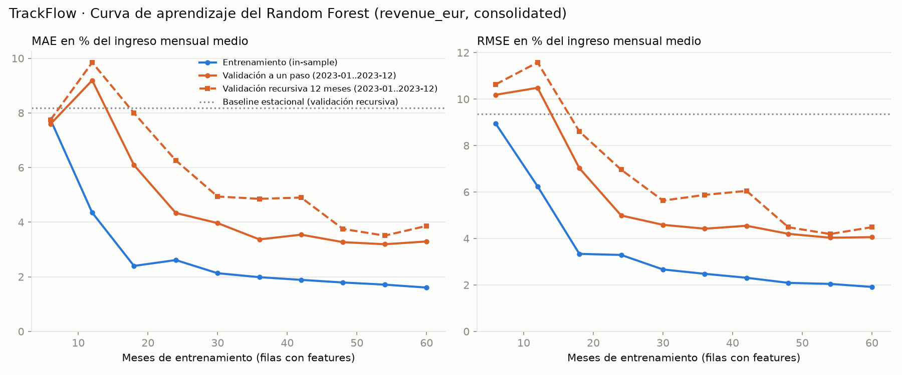

# Evaluación técnica del modelo de pronóstico de ingresos mensuales

Responde al ticket del tech lead antes de pasar a staging el Random Forest de `scripts/train_sales_forecast.py`, que pronostica
`revenue_eur` de la fila `consolidated` de `data/raw/trackflow_sales.csv`.

## Diagnóstico

**El modelo está bien ajustado: no tiene underfitting ni overfitting.** En validación temporal se equivoca un 4,0 ± 1,7 % del
ingreso mensual medio (MAE a un paso) frente al 6,8 % del baseline estacional. Con 60 meses de entrenamiento, la curva de
validación ya es plana, en el 3,2–3,3 %, cerca del ruido mensual de ±5 % que el modelo no puede predecir. Hacer el bosque
más simple **empeora** la validación, lo contrario de lo que pasaría si sobreajustara.

**Es estable a partir de 2 años de filas de entrenamiento.** Solo el primer fold (12 filas) se dispara al 7 %. Del fold 2 al 5,
la validación a un paso se mueve entre el 2,5 % y el 4,0 % (3,3 ± 0,6 %).

**El error que queda no está en el bosque sino en el nivel anual.** El crecimiento de TrackFlow alterna cada año entre ~3 % y
~9 %. El modelo no lo anticipa, así que subestima los años de crecimiento alto y sobreestima los de crecimiento bajo.
**Acción correctiva:** sacar el crecimiento anual del bosque. Se estima con la regla de alternancia y el bosque solo da la forma
estacional. En la misma validación cruzada, el error recursivo baja de 4,6 ± 2,0 % a 3,9 ± 1,1 % (MAE) y de 5,4 ± 2,5 % a
4,5 ± 1,3 % (RMSE). Más datos, regularización o más complejidad no atacan esta causa, y las pruebas lo confirman (§6).

## 1. Qué se evaluó y cómo reproducirlo

```bash
uv run python scripts/evaluate_sales_forecast.py         # CV, curva de aprendizaje y pruebas del diagnóstico (~20 s)
uv run pytest tests/pipelines/test_forecast_validation.py  # orden cronológico de los folds y ausencia de fuga
```

- **Modelo:** el de producción, sin cambios. Random Forest (500 árboles, `min_samples_leaf=2`) sobre el índice
  `revenue_t / media de los 12 meses previos`, con las features `month_of_year`, `last_year_index`, `trailing_growth` y
  `recent_momentum` (detalle en [`sales_forecast/README.md`](sales_forecast/README.md)).
- **Datos:** solo el entrenamiento, 2016–2023 (96 meses; ingreso mensual medio 975.378 €). La prueba 2024–2025 sigue reservada.
  Todas las cifras en % de este documento son sobre esos 975.378 €.
- **Salidas en `data/eval/`:** `learning_curve.png`, `evaluation_metrics.json` (resumen), `cv_folds.csv` (por fold) y
  `learning_curve.csv`. Semilla fija: dos ejecuciones dan los mismos números.

### Validación cruzada temporal

`TimeSeriesSplit(n_splits=5, test_size=12)` sobre los 96 meses, con ventana creciente: cada fold entrena con todo lo anterior y
valida el año natural siguiente (2019, 2020, 2021, 2022 y 2023). Cada validación recorre un año entero, con el valle de febrero
y el pico de noviembre–diciembre.

- **Sin barajar:** `TimeSeriesSplit` no baraja, y `assert_chronological` lo comprueba en cada ejecución. Ambos tramos son
  contiguos y crecientes, el entrenamiento empieza en 2016-01 y acaba antes de la validación, y cada validación empieza
  después de la anterior. Si algo no se cumple, la ejecución falla.
- **Sin fuga de lags ni medias móviles entre folds:** las features no se calculan una vez sobre toda la serie. Cada fold las
  reconstruye solo con sus meses de entrenamiento (`build_training_matrix(train.iloc[:inicio_validación])`). Los primeros 24
  meses del fold se usan solo como historia de los lags, nunca como filas.
- **Dos formas de validar:**
  - *A un paso:* el mes `t` usa los ingresos reales anteriores a `t`. Es comparable con el error de entrenamiento, así que se
    usa para diagnosticar sesgo y varianza.
  - *Recursiva:* desde diciembre se pronostican los 12 meses sin ver ningún ingreso real del año. Es el uso real de Finanzas y
    el mismo escenario que la prueba final.

`tests/pipelines/test_forecast_validation.py` lo verifica:

- El orden cronológico de los 5 folds: ningún índice de un fold posterior aparece antes que uno de un fold anterior.
- Que se rechazan folds barajados, solapados o que retroceden en el tiempo.
- Que multiplicar ×10 los ingresos desde la validación no cambia la matriz que recibe el modelo ni su pronóstico recursivo.
- Que en la validación a un paso cambiar el mes `t` solo afecta a los pronósticos posteriores a `t`.

## 2. Validación cruzada: media ± desviación estándar

Desviación estándar muestral entre los 5 folds. El error está en % del ingreso mensual medio y el sesgo es `real − pronóstico`
(negativo = sobreestima), igual que en `forecast_metrics.regression_report`.

| Conjunto | MAE | RMSE | MAE (EUR) | RMSE (EUR) | Sesgo |
|---|---|---|---|---|---|
| Entrenamiento (in-sample) | 1,96 ± 0,63 % | 2,51 ± 0,92 % | 19.155 ± 6.193 € | 24.499 ± 8.960 € | −0,04 % |
| **Validación a un paso** | **4,05 ± 1,73 %** | **4,81 ± 2,04 %** | 39.487 ± 16.869 € | 46.896 ± 19.921 € | +1,24 ± 2,88 % |
| Validación recursiva (12 meses) | 4,56 ± 1,99 % | 5,39 ± 2,54 % | 44.509 ± 19.372 € | 52.530 ± 24.728 € | +1,60 ± 3,71 % |
| Baseline estacional (recursivo) | 6,82 ± 0,90 % | 7,86 ± 1,00 % | 66.502 ± 8.765 € | 76.617 ± 9.753 € | +1,61 ± 7,06 % |

Por fold:

| Fold | Validación | Filas de entrenamiento | MAE entrenamiento | MAE validación a un paso | RMSE validación a un paso | MAE recursivo | Sesgo recursivo |
|---|---|---|---|---|---|---|---|
| 1 | 2019 | 12 | 3,03 % | 7,00 % | 8,33 % | 7,96 % | +6,90 % |
| 2 | 2020 | 24 | 2,02 % | 3,41 % | 3,93 % | 3,26 % | −0,39 % |
| 3 | 2021 | 36 | 1,71 % | 2,54 % | 3,09 % | 3,13 % | +1,64 % |
| 4 | 2022 | 48 | 1,45 % | 4,01 % | 4,63 % | 4,61 % | −3,02 % |
| 5 | 2023 | 60 | 1,60 % | 3,29 % | 4,06 % | 3,86 % | +2,88 % |

**Estabilidad.** Casi toda la desviación viene del fold 1: con 12 filas el bosque ve cada mes del año una sola vez. Sin él,
la validación a un paso queda en 3,31 ± 0,60 % (MAE) y 3,93 ± 0,64 % (RMSE). El modelo final entrena con 72 filas, por encima
de todos los folds. El baseline varía menos (±0,9) porque no aprende nada y su error es igual de alto todos los años. Fíjate
también en el signo del sesgo recursivo: alterna de un año a otro, y esa es la pista de la §5.

## 3. Curva de aprendizaje



La validación es fija (2023) y el entrenamiento usa las 6, 12, …, 60 filas más recientes antes de 2023. Al fijar el año de
validación, la curva solo refleja el tamaño del entrenamiento. Al usar las filas más recientes, no queda un hueco de meses entre
entrenamiento y validación. La línea punteada es el baseline estacional sobre 2023 (MAE 8,2 %).

| Filas | MAE entrenamiento | MAE validación a un paso | MAE validación recursiva | Brecha (validación a un paso − entrenamiento) |
|---|---|---|---|---|
| 12 | 4,35 % | 9,19 % | 9,85 % | 4,84 pts |
| 24 | 2,61 % | 4,34 % | 6,26 % | 1,73 pts |
| 36 | 1,98 % | 3,37 % | 4,85 % | 1,38 pts |
| 48 | 1,79 % | 3,27 % | 3,75 % | 1,48 pts |
| 60 | 1,60 % | 3,29 % | 3,86 % | 1,69 pts |

**Lectura.** Las dos curvas bajan y convergen hasta ~36 filas. Después la validación queda plana en el 3,2–3,5 % y la
brecha se estabiliza en ~1,5 puntos:

- **No es underfitting:** las curvas no convergen en un error alto. La validación termina en un 3,3 %, frente al 8,2 % del
  baseline sobre el mismo año. El techo realista lo marca el dataset: fuera de los picos, cada mes fluctúa ±5 % alrededor de la
  tendencia, y la amplitud de los picos varía entre +25 % y +35 % según el año (así se generó el dataset). Ese ruido no se puede predecir
  desde el histórico: un ±5 % uniforme ya da un MAE de ~2,5 %. El 3,3 % de validación está cerca de ese suelo.
- **No es overfitting:** queda una brecha, pero ni es amplia ni crece. Con 60 filas, la validación (3,3 %) es el doble que el
  entrenamiento (1,6 %), que está por debajo del suelo de ruido. Ese 1,6 % es el error in-sample normal de un Random Forest:
  cada fila está en la muestra bootstrap de ~2/3 de los árboles. Lo que distingue un overfitting es que la validación mejore al
  regularizar, y aquí empeora (§5).
- **Más datos no son la palanca:** de 36 a 60 filas, la validación a un paso no baja (3,37 → 3,29 %). Con datos mensuales,
  además, cada fila nueva tarda un mes en llegar.

## 4. MAE y RMSE: cuál refleja mejor el coste de negocio

| | MAE | RMSE |
|---|---|---|
| Entrenamiento | 19.155 € (1,96 %) | 24.499 € (2,51 %) |
| Validación a un paso | 39.487 € (4,05 %) | 46.896 € (4,81 %) |
| Validación recursiva | 44.509 € (4,56 %) | 52.530 € (5,39 %) |

**La métrica principal es el RMSE.** Motivos:

- **El coste está en los meses grandes.** Noviembre–diciembre concentran un 25–35 % más de ingresos que la media por Black
  Friday y Navidad. Ana (Almacén) y Carlos (Carriers) dimensionan con ese pico la plantilla y la capacidad
  contratada de transportistas.
  - Un fallo grande en un pico no cuesta lo mismo que varios fallos pequeños repartidos en meses tranquilos. Si se subestima,
    faltan manos y capacidad justo cuando más envíos hay. Si se sobreestima, sobra personal y capacidad contratada.
  - El RMSE eleva cada error al cuadrado, así que penaliza ese fallo grande más que la suma de los pequeños. El MAE los trata
    igual.
- **Es el KPI que pide Dirección:** el MSE en EUR² y en % del ingreso mensual medio. El RMSE es su raíz: misma ordenación de modelos, pero en euros que Thomas y Ana pueden leer.
- **El cociente RMSE/MAE sirve de alarma.** En validación es 1,15–1,23 en todos los folds, cerca del 1,25 que corresponde a
  errores normales sin colas. Hoy ningún mes concentra un fallo desproporcionado. Si el cociente sube, el modelo ha empezado a
  fallar un pico concreto aunque el MAE no se mueva, que es justo el riesgo operativo.

**El MAE se mantiene como métrica secundaria:** es la frase que entiende Finanzas ("de media, el pronóstico de cada mes se
desvía unos 40.000 €"), pero no distingue entre fallar un febrero y fallar un diciembre.

**Sobreestimar frente a subestimar.** Negocio no ha fijado un coste distinto para cada dirección, y tanto el RMSE como el MAE son
simétricos. Por eso el sesgo con signo se reporta aparte, y es lo que destapa el problema de la §5. El modelo no tiene un sesgo
fijo (+1,24 % de media, cerca de cero), pero sí uno que cambia de signo cada año, con una amplitud de ±3 %.

## 5. Diagnóstico: evidencia por hipótesis

| Hipótesis | Qué se esperaría | Qué se observa | Veredicto |
|---|---|---|---|
| Underfitting | Entrenamiento y validación altos y juntos; cerca del baseline | Entrenamiento 1,6 %, validación 3,3 %, baseline 8,2 % (2023); en CV, 4,05 % frente a 6,82 % | Descartado |
| Overfitting | Brecha amplia que no se cierra; regularizar baja la validación | La brecha se estabiliza en ~1,5 pts; regularizar sube la validación (tabla siguiente) | Descartado |
| Bien ajustado | Validación plana y cerca del ruido irreducible; brecha estable | Validación plana desde 36 filas en 3,2–3,5 %, con un suelo de ruido de ~2,5–3 % | **Sí** |

Prueba de regularización. Misma CV con hojas mínimas de 1, 2 (producción), 4 y 6 meses. Valores en MAE, % del ingreso medio:

| `min_samples_leaf` | Entrenamiento | Validación a un paso | Validación recursiva |
|---|---|---|---|
| 1 | 1,43 % | 3,66 % | 4,17 % |
| **2 (producción)** | 1,96 % | 4,05 % | 4,56 % |
| 4 | 3,57 % | 4,98 % | 5,22 % |
| 6 | 4,97 % | 5,96 % | 6,28 % |

Cuanto más se regulariza, más sube el error de validación. Si el modelo sobreajustara, pasaría lo contrario. Con hojas de 1
mes la validación mejora un poco (−0,4 pts), pero esa mejora es menor que la desviación entre folds (±1,7). No justifica
cambiar el modelo, y tampoco ataca el error sistemático que se ve a continuación.

**El error que queda tiene una causa concreta.** Según la descripción del dataset, el crecimiento anual alterna entre X+Y y X−Y. En los
datos se ve así:

| Año | 2017 | 2018 | 2019 | 2020 | 2021 | 2022 | 2023 |
|---|---|---|---|---|---|---|---|
| Crecimiento anual del ingreso | 9,6 % | 1,8 % | 9,4 % | 2,9 % | 8,0 % | 2,8 % | 10,1 % |

El modelo pone el nivel del año con la media de los 12 meses previos y con `trailing_growth`, que es el crecimiento del año
anterior: justo el del régimen contrario. Por eso:

- En los años de crecimiento alto (2019, 2021 y 2023), el pronóstico recursivo **subestima** un 6,9 %, un 1,6 % y un 2,9 %.
- En los de crecimiento bajo (2020 y 2022), **sobreestima** un 0,4 % y un 3,0 %.

Es un sesgo del nivel anual, no de la forma estacional: esa la capta bien (`month_of_year` y `last_year_index` suman el 93 % de
la importancia). Con una fila por mes y 5–6 años de historia, el bosque no tiene suficientes ciclos para aprender la alternancia.

## 6. Acción correctiva propuesta

**Separar el crecimiento anual del Random Forest:**

1. El bosque sigue igual y aporta solo la forma estacional del año: el reparto de los 12 meses, con el valle de febrero y el pico
   de noviembre–diciembre.
2. El nivel del año sale de un modelo explícito de crecimiento. Con la regla de alternancia, el crecimiento esperado
   es `2 · media histórica − crecimiento del último año`, calculado solo con años cerrados.
3. El pronóstico de 12 meses se reescala para que su total anual crezca lo que dice esa regla.
   Implementación de referencia: `alternating_growth_adjustment` en `scripts/evaluate_sales_forecast.py`.

Evidencia, con la misma CV recursiva y sin usar ningún dato del año validado:

| Fold | Crecimiento real | Crecimiento implícito del modelo | Crecimiento con la regla | MAE modelo → corregido | RMSE modelo → corregido |
|---|---|---|---|---|---|
| 2019 | 9,4 % | 1,7 % | 9,6 % | 7,96 → 5,66 % | 9,79 → 6,69 % |
| 2020 | 2,9 % | 3,3 % | 4,5 % | 3,26 → 3,26 % | 3,85 → 4,07 % |
| 2021 | 8,0 % | 6,4 % | 9,0 % | 3,13 → 2,91 % | 3,63 → 3,30 % |
| 2022 | 2,8 % | 5,6 % | 4,7 % | 4,61 → 4,15 % | 5,17 → 4,69 % |
| 2023 | 10,1 % | 7,5 % | 8,7 % | 3,86 → 3,26 % | 4,48 → 3,78 % |
| **Media ± desv.** | | | | **4,56 ± 1,99 → 3,85 ± 1,11 %** | **5,39 ± 2,54 → 4,51 ± 1,32 %** |

El RMSE, la métrica principal, mejora en 4 de 5 folds y la desviación entre folds se reduce casi a la mitad, así que el modelo
también gana estabilidad. El fold que empeora (2020: 3,85 → 4,07 %) es uno donde el modelo ya acertaba el crecimiento por
casualidad.

**Por qué las alternativas genéricas no sirven aquí:**

- **Más datos:** la curva de validación ya es plana (§3), y el sesgo no baja con más filas porque es estructural. Además, cada
  dato nuevo tarda un mes en llegar.
- **Regularizar:** sube el error de validación entre 0,9 y 1,9 pts (§5).
- **Más complejidad en el bosque:** en una prueba exploratoria (no versionada) se añadió el crecimiento de hace dos años como
  feature. El MAE a un paso no mejoró en los folds 2020–2023: 4,74 → 4,81 %. Con tan pocos años, el bosque no aprende la
  alternancia aunque se le dé la señal. El crecimiento tiene que entrar como regla explícita, no como feature.

**Riesgo y condición antes de producción.** La regla de alternancia viene de la descripción del dataset, no de una causa de
negocio conocida. Antes de implementarla en `scripts/train_sales_forecast.py`, hay que validar con Finanzas (Thomas) qué
crecimiento usar para el próximo año: la regla, el presupuesto comercial o una combinación. La separación entre nivel y forma
sirve con cualquiera de las tres, y es la parte que se recomienda adoptar. Después, se vuelve a pasar la prueba 2024–2025 con
el modelo corregido.

## 7. Límites

- **5 folds de 12 meses son pocos para una desviación estándar fina.** El ±1,7 está dominado por el fold 1. La lectura del
  sesgo alterno se apoya en el patrón de signos de los 5 años y en la descripción del dataset, no en un test estadístico.
- **El error de entrenamiento de un Random Forest es optimista por construcción.** La brecha se interpreta junto con la prueba de
  regularización, no sola. El R² out-of-bag del modelo final (0,879 sobre el índice) da una lectura intermedia.
- **La curva de aprendizaje usa un único año de validación (2023).** La CV, con 5 años distintos, complementa ese sesgo de año
  concreto.
- **No se evalúa el desglose Los Ángeles / Zaragoza:** el CSV solo trae `consolidated`.
