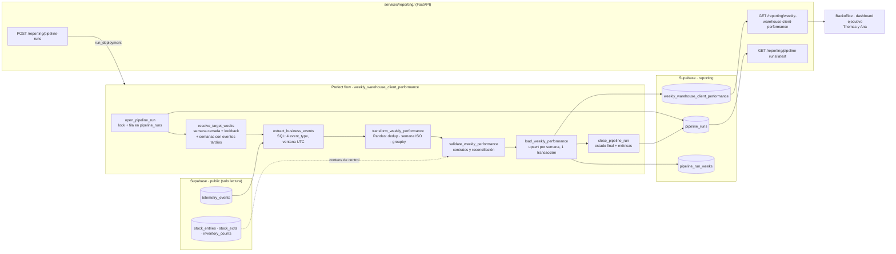

# Diseño — Pipeline de Desempeño de Negocio (`weekly_warehouse_client_performance`)

Documento de diseño (Parte 1 de 3), ya implementado en la Parte 2: aquí se fija qué produce el pipeline, de dónde lee, dónde
escribe, cómo se comporta ante fallos y cómo se organiza en Prefect. La [sección 16](#16-implementación-parte-2) resume el código,
el comando de ejecución, la frecuencia y las diferencias con este diseño. La división en subflows con tests (Parte 3) parte de aquí.

**Ejecución:** `uv run python data/pipelines/pipeline.py` desde la raíz (lee `DATABASE_URL` del entorno o del `.env` raíz).
**Frecuencia:** semanal, los lunes a las 02:00 UTC (`0 2 * * 1`), con `uv run python data/pipelines/pipeline.py --serve`.

## Contenido

1. [Estado actual](#1-estado-actual)
2. [Brecha de negocio](#2-brecha-de-negocio)
3. [Propósito](#3-propósito)
4. [Extracción](#4-extracción)
5. [Flujo de datos](#5-flujo-de-datos)
6. [Transformación y reglas de cálculo](#6-transformación-y-reglas-de-cálculo)
7. [Destino: esquema `reporting`](#7-destino-esquema-reporting)
8. [Registros que cambian: recálculo de semanas ya publicadas](#8-registros-que-cambian-recálculo-de-semanas-ya-publicadas)
9. [Idempotencia](#9-idempotencia)
10. [Log de ejecución](#10-log-de-ejecución)
11. [Observabilidad y recuperabilidad](#11-observabilidad-y-recuperabilidad)
12. [Mapeo a Prefect](#12-mapeo-a-prefect)
13. [Integración con la aplicación: `services/reporting/`](#13-integración-con-la-aplicación-servicesreporting)
14. [Preguntas de diseño respondidas](#14-preguntas-de-diseño-respondidas)
15. [Fuera de alcance y riesgos](#15-fuera-de-alcance-y-riesgos)
16. [Implementación (Parte 2)](#16-implementación-parte-2)

---

## 1. Estado actual

### Qué se captura

Toda la telemetría vive en una sola tabla de Supabase (PostgreSQL), `telemetry_events`, definida en
`services/api/telemetry_storage.py`:

| Columna | Tipo | Contenido |
|---|---|---|
| `id` | `varchar(36)` PK | `eventId` del envelope (UUID v4). Un reintento con el mismo `eventId` no crea fila (`ON CONFLICT DO NOTHING`). |
| `event_type` | `varchar(60)` | Uno de los 42 tipos de `docs/telemetry/event-schemas.json`. |
| `timestamp` | `timestamptz` | Momento del hecho. En los eventos de la API, la hora del servidor de la operación. |
| `service` | `varchar(20)` | `source` del envelope: `api`, `backoffice` o `job`. |
| `user_id`, `session_id` | `varchar` | `sub` del JWT y sesión de la pestaña (o `job:...`). |
| `tags` | `jsonb` | `properties` del envelope, ya recortado al allowlist del evento. |
| `received_at` | `timestamptz` | Hora de llegada al almacén (`now()` del servidor de base de datos). |

Propiedades de la tabla que este diseño aprovecha:

- **Inmutable.** Un trigger rechaza `UPDATE` y `DELETE`. Un evento guardado no cambia nunca; lo único que puede pasar es que
  lleguen eventos nuevos, también con `timestamp` antiguo.
- **Índices** en `timestamp`, `event_type` y GIN en `tags`. No hay índice en `received_at`.
- **RLS activado sin políticas**: solo un cliente que se conecta como propietario con `DATABASE_URL` puede leerla.
- No guarda `requestId`, `schemaVersion` ni `environment` (siguen en el log `trackflow.telemetry`). Cada entorno usa su propio
  proyecto de Supabase.

Los cuatro eventos **obligatorios** de inventario los emite solo la API (`source = api`), después del `commit` del movimiento, y
`ApiEventBuffer` los inserta en bloque al terminar la respuesta. El navegador no los puede enviar: la ingesta `POST /telemetry/events`
solo acepta eventos con emisor `backoffice`. Todavía **no hay outbox transaccional**: si el proceso cae entre el `commit` y el
insert del buffer, el evento se pierde (restricción abierta en `memory-bank/techContext.md`).

### Qué responde hoy el reporte técnico

`GET /telemetry/report` (`services/api/routes/telemetry_report.py`) y las funciones de `services/telemetry/analysis.py` sirven al
equipo de ingeniería, por día UTC y en una ventana de hasta 90 días:

- `events_per_day`: volumen por día y emisor, con sesiones distintas.
- `events_by_type`: peso de cada `event_type` y última vez visto.
- `error_rate_by_type`: fallos `system` / `rejected` sobre el total del día.
- `page_load_by_route`: p75 de Web Vitals por ruta.
- `auth_failure_rate`: logins fallidos sobre intentos.

Este pipeline **no toca** esa ruta: `services/telemetry/analysis.py`, `GET /telemetry/report` y la vista `/telemetry` del
backoffice quedan como están.

## 2. Brecha de negocio

El reporte técnico cuenta eventos; no sabe qué es un almacén, un cliente ni un pedido. Ninguna de sus métricas separa por
`warehouse` ni por `client_id`, ninguna lee `tags.quantity` y ninguna agrupa por semana. Por eso hoy los directores de TrackFlow
arman a mano, cada domingo por la noche, el consolidado que Thomas (CEO) quiere abrir el lunes sin llamar a Ana (Head of Warehouse
Operations) ni a Miguel (Comercial).

Las preguntas que siguen sin respuesta fiable son exactamente los cuatro KPIs de `CONTEXT-company.md`:

| KPI | Pregunta de negocio sin responder | Por qué el reporte técnico no la cubre |
|---|---|---|
| Volumen de entrada | ¿Cuántas unidades de cada cliente recibió cada almacén esta semana? | Cuenta eventos, no suma `quantity`; no agrupa por almacén ni cliente. |
| Throughput de salida | ¿Cuántos pedidos despachó cada almacén para cada cliente? | No distingue `dispatch` de `loss` ni agrupa por cliente. |
| Frecuencia de quiebre de stock | ¿Cuántas veces cayó por debajo del mínimo un SKU de un cliente en un almacén? | `stock_threshold_triggered` solo aparece como un tipo más en `events_by_type`. |
| Tasa de discrepancia | ¿Qué combinaciones almacén/cliente necesitan una auditoría? | Exige cruzar dos tipos de evento por almacén y cliente; el reporte técnico nunca cruza tipos. |

Además el reporte técnico se calcula en cada petición (con caché de 60 s) y no deja rastro: no hay forma de saber qué número se
publicó una semana ni si cambió después. Un reporte ejecutivo necesita un resultado **materializado, versionado por corrida y
auditable**, que es lo que añade este pipeline.

## 3. Propósito

> El pipeline `weekly_warehouse_client_performance` produce, cada lunes de madrugada (UTC), el consolidado que alimenta el
> **"Reporte Semanal de Desempeño por Almacén y Cliente"** de Thomas (CEO) y Ana (Head of Warehouse Operations): una fila por
> `warehouse` × `client_id` × semana ISO con los KPIs **volumen de entrada**, **throughput de salida**, **frecuencia de quiebre de
> stock** y **tasa de discrepancia**, calculados a partir de las métricas obligatorias `inbound_order_created`,
> `outbound_order_created`, `stock_threshold_triggered` e `inventory_discrepancy_detected` de `telemetry_events`.

Cualquier etapa que no sostenga esa frase queda fuera de la v1 (ver [sección 15](#15-fuera-de-alcance-y-riesgos)).

## 4. Extracción

### Fuente

| Fuente | Uso | Modo |
|---|---|---|
| `telemetry_events` | Única fuente de los KPIs. | Solo lectura. El pipeline nunca escribe ahí. |
| `stock_entries`, `stock_exits`, `inventory_counts` | Solo **reconciliación** (contar movimientos reales por semana y almacén para detectar eventos perdidos, [sección 11](#11-observabilidad-y-recuperabilidad)). No alimentan ningún KPI. | Solo lectura. |

### Forma del dato

Cada fila llega como columnas fijas más `tags` (JSONB). La extracción lee solo los cuatro `event_type` y solo las claves de
`tags` que el cálculo necesita:

| `event_type` | Claves de `tags` que se leen | Claves de negocio del evento |
|---|---|---|
| `inbound_order_created` | `warehouse`, `client_id`, `quantity` (entero ≥ 1, unidades recibidas), `order_id` | `order_id` = `StockEntry.id` |
| `outbound_order_created` | `warehouse`, `client_id`, `exit_type` (`dispatch`/`loss`), `order_id` | `order_id` = `StockExit.id` |
| `stock_threshold_triggered` | `warehouse`, `client_id`, `product_id`, `stock_level` (`low`/`out`), `triggering_order_id` | (`product_id`, `warehouse`, `stock_level`, `triggering_order_id`) |
| `inventory_discrepancy_detected` | `warehouse`, `client_id`, `count_id` | `count_id` = `InventoryCount.id` |

Vocabulario de dominio (definido en `event-schemas.json` y `services/api/inventory_telemetry.py`):

- `warehouse`: `los_angeles` (`LA`, país `US`) o `zaragoza` (`ZGZ`, país `ES`).
- `client_id`: slug de `SKU.client_name` (`PureStep Footwear` → `purestep-footwear`), patrón `^[a-z0-9]+(-[a-z0-9]+)*$`.

Ejemplo de fila extraída (`outbound_order_created`):

```json
{
  "id": "6f1c2a9e-8d0b-4c7e-9a51-2b3f4d5e6a7b",
  "event_type": "outbound_order_created",
  "timestamp": "2026-07-15T09:41:12.381Z",
  "received_at": "2026-07-15T09:41:12.902Z",
  "tags": {
    "order_id": 1842, "warehouse": "zaragoza", "country": "ES", "client_id": "purestep-footwear",
    "product_id": "CLT-SNK-W-42", "product_category": "fashion", "quantity": 3,
    "exit_type": "dispatch", "stock_after": 117, "user_role": "user"
  }
}
```

### Consulta

Una sola consulta por corrida, con SQLAlchemy Core, que aprovecha los índices de `timestamp` y `event_type` y saca las claves de
`tags` en SQL para no traer el JSONB entero:

```sql
select id, event_type, "timestamp", received_at,
       tags->>'warehouse' as warehouse,
       tags->>'client_id' as client_id,
       (tags->>'quantity')::int as quantity,
       tags->>'exit_type' as exit_type,
       tags->>'order_id' as order_id,
       tags->>'count_id' as count_id,
       tags->>'product_id' as product_id,
       tags->>'stock_level' as stock_level,
       tags->>'triggering_order_id' as triggering_order_id
from telemetry_events
where event_type in ('inbound_order_created', 'outbound_order_created',
                     'stock_threshold_triggered', 'inventory_discrepancy_detected')
  and "timestamp" >= :window_start   -- lunes 00:00 UTC de la semana más antigua a recalcular
  and "timestamp" <  :window_end     -- lunes 00:00 UTC de la semana en curso (nunca se incluye)
  and service = 'api';
```

`service = 'api'` es defensivo: la ingesta ya impide que el navegador envíe obligatorios, pero el pipeline no depende de eso.

### Cadencia de actualización de la fuente

- La fuente se **actualiza de forma continua**: cada respuesta de la API que registra una entrada, salida o conteo inserta sus
  eventos en segundos. `event-schemas.json` declara `inbound_order_created` como *batch horario*, `outbound_order_created` y
  `stock_threshold_triggered` como *stream* e `inventory_discrepancy_detected` como *batch diario*; para un entregable semanal las
  tres cadencias son más que suficientes.
- Solo hay inserciones (la tabla es inmutable). Los retrasos posibles son pequeños (la API usa la hora del servidor y escribe tras
  la respuesta) salvo caída del almacén o reproceso manual; por eso el pipeline recalcula una ventana de semanas y no solo la
  última ([sección 8](#8-registros-que-cambian-recálculo-de-semanas-ya-publicadas)).

### Cadencia del pipeline

- **Programado:** lunes a las 02:00 UTC (`0 2 * * 1`). La semana ISO cierra el lunes a las 00:00 UTC (domingo 16:00/17:00 en Los
  Ángeles), así que a las 02:00 la semana anterior está completa en los dos almacenes y el dato está listo antes de que empiece el
  lunes laboral en Zaragoza (08:00 CEST = 06:00 UTC) y en Los Ángeles.
- **Manual:** `POST /reporting/pipeline-runs` desde el backoffice, para una semana cerrada concreta.
- **Backfill:** flow aparte para un rango de semanas (opcional en la Parte 1, ver [sección 12](#12-mapeo-a-prefect)).

Nunca se calcula la semana en curso: un número parcial en un reporte ejecutivo se lee como una caída.

## 5. Flujo de datos



Las tres etapas centrales están separadas por contratos explícitos:

| Etapa | Entrada | Salida |
|---|---|---|
| **Extracción** (`extract_business_events`) | Ventana `[window_start, window_end)` | DataFrame `business_events` con una fila por evento y las columnas de la consulta. |
| **Transformación** (`transform_weekly_performance`) | `business_events` | DataFrame `weekly_performance` con el grano y las columnas exactas de la tabla de destino, más `events_by_type` por semana para el log. |
| **Carga** (`load_weekly_performance`) | `weekly_performance` agrupado por `week_start` | Filas en `reporting.weekly_warehouse_client_performance` y una fila por semana en `reporting.pipeline_run_weeks`. |

## 6. Transformación y reglas de cálculo

Funciones puras en `data/process/weekly_performance.py` (mismos datos → mismo resultado, sin E/S), siguiendo el orden del
reporte técnico: refinar → convertir tipos → deduplicar → agrupar → agregar.

1. **Convertir tipos.** `timestamp` con `pd.to_datetime(utc=True)` antes de cualquier agrupación; `quantity` a entero.
2. **Descartar filas sin dimensión.** Sin `warehouse` válido (`los_angeles`/`zaragoza`) o sin `client_id` que cumpla el patrón: se
   cuentan en `rows_rejected` del log, nunca se imputan a un cliente.
3. **Deduplicar** por `id` y por la clave de negocio de cada tipo (tabla de la [sección 4](#forma-del-dato)); se conserva el de
   menor `received_at`. Se cuenta en `duplicates_dropped`.
4. **Semana ISO.** `week_start = (timestamp.normalize() - pd.to_timedelta(timestamp.dt.weekday, unit="D")).dt.date`: el lunes UTC
   de esa semana. Se usa `timestamp` (momento del hecho), nunca `received_at`.
5. **Agregar** por (`warehouse`, `client_id`, `week_start`):

| Columna | Regla | KPI |
|---|---|---|
| `inbound_units_count` | Suma de `quantity` de `inbound_order_created`. | Volumen de entrada |
| `outbound_orders_count` | Conteo de `outbound_order_created` con `exit_type = 'dispatch'`. | Throughput de salida |
| `stockout_events_count` | Conteo de `stock_threshold_triggered` (niveles `low` y `out`). | Frecuencia de quiebre de stock |
| `discrepancy_events_count` | Conteo de `inventory_discrepancy_detected`. | Apoyo de la tasa de discrepancia |
| `discrepancy_rate` | `discrepancy_events_count / outbound_orders_count`, redondeado a 4 decimales; `0` si `outbound_orders_count = 0`. | Tasa de discrepancia |

Decisiones de cálculo:

- **Solo `dispatch` cuenta como pedido.** El KPI es "cuántos pedidos preparó y despachó un almacén"; una salida `loss` es una baja
  por pérdida, no un pedido. Contarla inflaría el throughput justo en los almacenes con más mermas y bajaría artificialmente su
  tasa de discrepancia. Las `loss` excluidas se registran en `pipeline_run_weeks.events_by_type` para que el número sea
  reconstruible.
- **Cada cruce de umbral cuenta una vez.** `stock_threshold_triggered` se dispara por flanco (como máximo un evento abierto por
  `product_id`, `warehouse` y `stock_level`), así que contar eventos es contar caídas reales bajo el mínimo. `low` y `out` cuentan
  los dos: un SKU que pasa de 60 a 0 en una salida genera los dos niveles y son dos avisos distintos para Miguel.
- **`discrepancy_rate` puede ser mayor que 1** (muchos conteos con diferencia y pocos despachos en la semana). No se recorta: el
  valor alto es justo la señal de "auditar aquí".
- **Una fila por cliente.** Nunca se agrega entre clientes; un total por almacén lo calcula el consumidor sumando filas.
- **Solo combinaciones con actividad.** Se escribe una fila para cada (`warehouse`, `client_id`, `week_start`) con al menos un
  evento de los cuatro tipos. Una combinación sin actividad no tiene fila; la diferencia entre "sin actividad" y "sin datos" la da
  `pipeline_run_weeks` ([sección 11](#11-observabilidad-y-recuperabilidad)).

## 7. Destino: esquema `reporting`

Todo lo que escribe el pipeline vive en el esquema dedicado `reporting`. Nada se escribe en `telemetry_events` ni en el esquema
`public`.

### `reporting.weekly_warehouse_client_performance` (tabla del entregable)

Exactamente la definida en `CONTEXT-company.md`:

```sql
create schema if not exists reporting;

create table reporting.weekly_warehouse_client_performance (
  id uuid primary key default gen_random_uuid(),
  warehouse text not null,
  client_id text not null,
  week_start date not null,
  inbound_units_count integer not null default 0,
  outbound_orders_count integer not null default 0,
  stockout_events_count integer not null default 0,
  discrepancy_events_count integer not null default 0,
  discrepancy_rate numeric not null default 0,
  computed_at timestamptz not null default now(),
  unique (warehouse, client_id, week_start)
);
```

`unique (warehouse, client_id, week_start)` es la clave del upsert. El rastro de qué corrida escribió cada semana va en
`pipeline_run_weeks`, no en columnas extra, para no alterar el contrato de la tabla del entregable.

### `reporting.pipeline_runs` (una fila por corrida)

Genérica: sirve para este pipeline y para los futuros (inventario, tracking, devoluciones). Campos y justificación en la
[sección 10](#10-log-de-ejecución).

```sql
create table reporting.pipeline_runs (
  run_id uuid primary key,
  pipeline_name text not null,
  trigger text not null check (trigger in ('schedule', 'manual', 'backfill')),
  triggered_by text not null,
  prefect_flow_run_id uuid,
  status text not null check (status in ('pending', 'running', 'completed', 'failed', 'crashed', 'cancelled')),
  phase text check (phase in ('extract', 'transform', 'validate', 'load', 'done')),
  weeks_requested date[] not null,
  window_start timestamptz,
  window_end timestamptz,
  source_watermark timestamptz,
  events_extracted integer not null default 0,
  duplicates_dropped integer not null default 0,
  rows_rejected integer not null default 0,
  rows_upserted integer not null default 0,
  rows_changed integer not null default 0,
  started_at timestamptz not null default now(),
  heartbeat_at timestamptz not null default now(),
  finished_at timestamptz,
  duration_ms integer,
  error_type text,
  error_message text,
  retry_of uuid references reporting.pipeline_runs (run_id)
);

-- Como mucho una corrida activa por pipeline: el cron y el disparo manual no pueden solaparse.
create unique index pipeline_runs_one_active
  on reporting.pipeline_runs (pipeline_name)
  where status in ('pending', 'running');
```

### `reporting.pipeline_run_weeks` (una fila por corrida y semana)

Checkpoint de la carga y rastro de auditoría de cada semana publicada:

```sql
create table reporting.pipeline_run_weeks (
  run_id uuid not null references reporting.pipeline_runs (run_id),
  week_start date not null,
  status text not null check (status in ('pending', 'loaded', 'failed')),
  events_by_type jsonb not null default '{}',   -- {"inbound_order_created": 412, "outbound_order_created_dispatch": 980, ...}
  reconciliation jsonb not null default '{}',   -- conteos de stock_entries/stock_exits/inventory_counts de la misma semana
  rows_upserted integer not null default 0,
  rows_changed integer not null default 0,      -- filas cuyo valor cambió respecto a lo ya publicado
  source_max_received_at timestamptz,
  loaded_at timestamptz,
  primary key (run_id, week_start)
);
```

Las tres tablas tienen RLS activado y sin políticas, igual que `telemetry_events`: solo la API y el pipeline (propietarios vía
`DATABASE_URL`) las leen y escriben. El DDL vive en `data/pipelines/weekly_warehouse_client_performance/schema.py` (SQLAlchemy
Core: el índice parcial con `postgresql_where`) y lo aplica `ensure_schema`, idempotente, en la primera task de cada corrida:
`create schema if not exists reporting`, `create_all` de lo que falte, `default gen_random_uuid()` en `id` y RLS.

## 8. Registros que cambian: recálculo de semanas ya publicadas

La fuente nunca actualiza registros: `telemetry_events` es de solo inserción y el trigger lo garantiza. Lo que sí cambia es el
**destino**: una fila semanal ya publicada debe corregirse cuando llega tarde un evento con `timestamp` de esa semana, o cuando
se reprocesa una semana tras arreglar un bug. La estrategia es **recalcular la semana entera y hacer upsert por la clave natural**,
nunca sumar deltas:

1. **Semanas objetivo** (`resolve_target_weeks`):
   - la última semana cerrada;
   - las `lookback_weeks` anteriores (3 por defecto, configurable en el bloque de configuración);
   - cualquier otra semana con eventos tardíos: `distinct week_start` de los eventos con `received_at > :last_watermark` y
     `timestamp >= now() - interval '90 days'` (el filtro por `timestamp` usa el índice existente; no se añade índice a
     `telemetry_events`).
2. **Recálculo completo** de cada semana objetivo desde `telemetry_events` (extracción por ventana, no incremental).
3. **Upsert por clave natural:**

```sql
insert into reporting.weekly_warehouse_client_performance
  (warehouse, client_id, week_start, inbound_units_count, outbound_orders_count,
   stockout_events_count, discrepancy_events_count, discrepancy_rate, computed_at)
values (...)
on conflict (warehouse, client_id, week_start) do update set
  inbound_units_count      = excluded.inbound_units_count,
  outbound_orders_count    = excluded.outbound_orders_count,
  stockout_events_count    = excluded.stockout_events_count,
  discrepancy_events_count = excluded.discrepancy_events_count,
  discrepancy_rate         = excluded.discrepancy_rate,
  computed_at              = excluded.computed_at
where (weekly_warehouse_client_performance.inbound_units_count,
       weekly_warehouse_client_performance.outbound_orders_count,
       weekly_warehouse_client_performance.stockout_events_count,
       weekly_warehouse_client_performance.discrepancy_events_count,
       weekly_warehouse_client_performance.discrepancy_rate)
   is distinct from
      (excluded.inbound_units_count, excluded.outbound_orders_count, excluded.stockout_events_count,
       excluded.discrepancy_events_count, excluded.discrepancy_rate)
returning (xmax = 0) as inserted;
```

   El `where ... is distinct from` hace que una fila sin cambios no se toque (conserva su `computed_at`), así que
   `computed_at` significa "último momento en que este número cambió", y `returning` permite contar `rows_changed`.
4. **Watermark.** Al cerrar con éxito, la corrida guarda en `source_watermark` el mayor `received_at` que procesó; la siguiente lo
   usa como `:last_watermark`.

¿Por qué no hace falta borrar filas? Porque la fuente solo crece: recalcular una semana con más eventos produce las mismas
combinaciones o más, nunca menos. La única excepción sería un cambio de reglas de cálculo que elimine una combinación; ese caso se
resuelve con el flow de backfill, que borra y reescribe la semana dentro de la misma transacción y lo deja registrado en
`pipeline_run_weeks`.

## 9. Idempotencia

**Garantía:** correr el pipeline N veces sobre las mismas semanas y la misma fuente deja exactamente las mismas filas que una sola
corrida limpia.

Se apoya en cuatro mecanismos, cada uno en su capa:

| Capa | Mecanismo | Qué evita |
|---|---|---|
| Ingesta (ya existe) | `telemetry_events.id` = `eventId` con `ON CONFLICT DO NOTHING`. | Un lote reintentado no crea filas duplicadas en la fuente. |
| Transformación | `drop_duplicates` por `id` y por clave de negocio (`order_id`, `count_id`, ...). | Una reemisión con `eventId` nuevo no cuenta dos veces el mismo pedido o conteo. |
| Carga | Recalcular la semana completa (valores absolutos, nunca `+=`) y upsert por `unique (warehouse, client_id, week_start)`. | Repetir la carga no duplica ni acumula. |
| Orquestación | Índice único parcial `pipeline_runs_one_active` + límite de concurrencia de Prefect. | Dos corridas no escriben la misma semana a la vez. |

### Qué pasa exactamente si la carga falla y se vuelve a correr

Caso: la corrida programada carga la semana del 6 de julio, y al cargar la del 13 de julio (1.412 filas) Supabase corta la conexión
por timeout después de enviar 847.

1. **Cada semana se carga en su propia transacción**, con un único `INSERT ... VALUES (...), (...) ON CONFLICT ...` (como
   `store_events` en la ingesta). El timeout aborta la transacción y PostgreSQL hace rollback: las 847 filas **nunca llegan a ser
   visibles**. La semana del 13 de julio queda con su versión anterior completa (o sin filas si era nueva), nunca a medias.
2. La semana del 6 de julio ya hizo commit y su fila en `pipeline_run_weeks` está en `loaded`. La del 13 queda en `failed`.
3. La tarea `load_weekly_performance` tiene `retries=3` con espera exponencial: el primer reintento repite el upsert de la semana
   del 13 con los mismos datos (el resultado de la transformación está persistido, [sección 12](#12-mapeo-a-prefect)). Si entra,
   la corrida termina en `completed`.
4. Si se agotan los reintentos, la corrida termina en `failed` con `phase = 'load'`, `error_type` y `error_message`. La siguiente
   corrida (manual o la del lunes siguiente) se crea con `retry_of` apuntando a la fallida, **vuelve a extraer y a calcular** las
   semanas objetivo y las carga todas otra vez. La semana del 6 de julio se reescribe con valores idénticos (`rows_changed = 0`,
   no cambia ni su `computed_at`) y la del 13 se carga entera.
5. Resultado: el mismo que una corrida limpia. No hay duplicados porque el `unique` lo impide, y no hay valores inflados porque el
   upsert escribe totales recalculados, no incrementos.

Un fallo antes de la carga (extracción o transformación) no escribe nada en `weekly_warehouse_client_performance`: reintentar es
siempre seguro.

## 10. Log de ejecución

Cada corrida deja una fila en `reporting.pipeline_runs` (estado y métricas de la corrida) y una por semana en
`reporting.pipeline_run_weeks` (detalle de lo publicado). Además, cada task escribe en el logger `trackflow.pipelines` con
`run_id` en cada línea, que Prefect recoge en la UI del flow run.

| Campo | Tipo | Por qué es necesario para auditar |
|---|---|---|
| `run_id` | `uuid` | Identificador único de la corrida. Correlaciona la fila, los logs de Prefect, los logs de la API (`POST /reporting/pipeline-runs` lo devuelve) y `pipeline_run_weeks`. Sin él no se puede decir qué corrida produjo un número. |
| `pipeline_name` | `text` | La tabla es compartida por futuros pipelines (inventario, tracking, devoluciones); filtra el historial y aplica el lock por pipeline. |
| `trigger` / `triggered_by` | `text` | Distingue cron, disparo manual y backfill, y quién lo hizo (`system:prefect` o el `sub` del JWT). Responde "¿quién recalculó esta semana y por qué?". |
| `prefect_flow_run_id` | `uuid` | Enlaza con el flow run de Prefect para ver los logs completos y el estado de cada task. |
| `status` | `text` | `pending`/`running`/`completed`/`failed`/`crashed`/`cancelled`. Es lo que lee `GET /reporting/pipeline-runs/latest` y lo que decide si los números de la semana son de fiar. |
| `phase` | `text` | Última etapa alcanzada (`extract`, `transform`, `validate`, `load`, `done`). Es el checkpoint: dice dónde se cayó una corrida fallida y desde dónde investigar. |
| `weeks_requested` | `date[]` | Semanas que la corrida debía recalcular. Permite comprobar que ninguna semana se quedó sin procesar. |
| `window_start` / `window_end` | `timestamptz` | Ventana exacta leída de `telemetry_events`. Con ella se repite la extracción y se comprueba el resultado. |
| `source_watermark` | `timestamptz` | Mayor `received_at` procesado. Detecta eventos tardíos en la siguiente corrida y prueba hasta dónde llegaba la fuente cuando se publicó el número. |
| `events_extracted` | `integer` | Eventos leídos. Una caída brusca frente a semanas anteriores indica pérdida de captura, no de actividad. |
| `duplicates_dropped` / `rows_rejected` | `integer` | Cuánto se descartó y por qué. Un aumento señala un problema de emisión (reemisiones, `client_id` mal formado) antes de que distorsione los KPIs. |
| `rows_upserted` / `rows_changed` | `integer` | Filas escritas y filas cuyo valor cambió. `rows_changed > 0` en una semana ya publicada es la marca de que un número que Thomas ya leyó fue corregido. |
| `started_at` / `finished_at` / `duration_ms` | `timestamptz` / `integer` | Cuándo corrió y cuánto tardó. Detecta corridas que no se lanzaron (no hay fila del lunes) o que se degradan con el volumen. |
| `heartbeat_at` | `timestamptz` | Se actualiza al terminar cada task. Una corrida `running` sin heartbeat en 15 minutos se considera muerta (`crashed`) y libera el lock. |
| `error_type` / `error_message` | `text` | Clase de la excepción y mensaje saneado (sin credenciales ni cadena de conexión, igual que la ingesta). Permite actuar sin abrir los logs. |
| `retry_of` | `uuid` | Enlaza una corrida de recuperación con la que falló; reconstruye la historia completa de un incidente. |

## 11. Observabilidad y recuperabilidad

### Distinguir "cero actividad" de "no hay datos"

Tres señales distintas, cada una con su comprobación:

| Situación | Señal | Comprobación |
|---|---|---|
| El pipeline no corrió | No hay fila en `pipeline_runs` con `status = 'completed'` cuya `weeks_requested` incluya la última semana cerrada. | `GET /reporting/pipeline-runs/latest` devuelve `stale: true` si la última corrida completada tiene más de 8 días. El backoffice lo muestra en la cabecera del reporte. |
| Corrió pero la captura falló | `pipeline_run_weeks.events_by_type` por debajo del 50 % de la media de las 4 semanas anteriores **y** la reconciliación con `stock_exits`/`stock_entries` muestra movimientos sin evento. | `reconcile_with_domain_tables` registra un `WARNING` con la diferencia y marca la semana con `reconciliation.status = 'gap'`; la corrida termina `completed` pero el endpoint de KPIs devuelve el aviso. |
| Actividad real cero | Los eventos y los movimientos de las tablas de dominio coinciden en cero para esa combinación. | No hay fila para esa combinación, la semana está `loaded` y la reconciliación está `ok`. |

### Reconciliación con las tablas de dominio

Como los obligatorios aún no tienen outbox, un evento puede perderse si la API cae después del `commit`. La tabla de dominio es la
verdad: `validate_weekly_performance` cuenta por semana y almacén las filas de `stock_entries`, `stock_exits` (`exit_type =
'dispatch'`) e `inventory_counts` con diferencia y las compara con los eventos. Una diferencia distinta de cero se guarda en
`pipeline_run_weeks.reconciliation` y en el log. Así se separa **crecimiento** (eventos y movimientos suben a la vez) de
**pérdida** (los movimientos suben y los eventos no) o **duplicación** (más eventos que movimientos tras deduplicar). La v1 no
corrige los KPIs con estos conteos: los reporta.

### Trazabilidad evento → reporte

- Fila del reporte → (`warehouse`, `client_id`, `week_start`) → `pipeline_run_weeks` de la corrida que la cambió por última vez
  (`rows_changed > 0`) → `pipeline_runs` (ventana, watermark) → los eventos de `telemetry_events` de esa ventana.
- `requestId` no se persiste en `telemetry_events` (solo está en el log `trackflow.telemetry`), así que la correlación con la
  petición original se hace por `eventId` y `order_id`/`count_id`. Si en el futuro hace falta, añadirlo es un cambio de la
  telemetría, no de este pipeline.
- Ráfagas o dobles ventanas: como cada semana se recalcula completa y se registra por separado en `pipeline_run_weeks`, una corrida
  que procesa varias semanas deja una fila por semana; nunca mezcla dos ventanas en un número.

### Recuperación tras una caída

| Fallo | Comportamiento |
|---|---|
| Caída de Supabase en la extracción | Task `extract_business_events` con `retries=3` (30 s, 60 s, 120 s). Si se agotan, la corrida termina `failed`, `phase = 'extract'`, sin escrituras. |
| Pandas termina y falla el `INSERT` | El resultado de `transform_weekly_performance` está persistido como resultado de Prefect (clave: hash de los `id` de los eventos + semanas + `CALCULATION_VERSION`, válida 1 hora). Dentro de la misma corrida, el reintento de la carga recibe el mismo resultado en memoria; una corrida repetida en la hora siguiente con los mismos eventos lo reutiliza sin recalcular. |
| Fallo a mitad de la carga | Las semanas `loaded` ya están confirmadas; la semana que fallaba hizo rollback completo. Reintentar recarga todo con upsert ([sección 9](#9-idempotencia)). |
| El proceso del worker muere | Prefect marca el flow run `Crashed`. La fila queda `running` sin heartbeat; la siguiente corrida la pasa a `crashed` (si `heartbeat_at` tiene más de 15 min), libera el lock y crea la suya con `retry_of`. |

## 12. Mapeo a Prefect

Prefect 3 es dependencia del proyecto (`pyproject.toml` y `services/api/requirements.txt`). El flow y sus tasks viven en
`data/pipelines/pipeline.py` (punto de entrada y CLI); la E/S, en `data/pipelines/weekly_warehouse_client_performance/`; la lógica
de cálculo reutilizable, en `data/process/weekly_performance.py`.

```
data/
├── pipelines/
│   ├── PIPELINE_DESIGN.md
│   ├── pipeline.py         # flow, tasks, deployment (--serve) y CLI
│   └── weekly_warehouse_client_performance/
│       ├── database.py    # motor propio desde DATABASE_URL (SQLite: esquema reporting adjunto)
│       ├── storage.py     # lectura de telemetry_events y tablas de dominio; upsert por semana
│       ├── runs.py        # lectura/escritura de reporting.pipeline_runs (lock, heartbeat, estado)
│       ├── queries.py     # lecturas para services/reporting (KPIs)
│       └── schema.py      # DDL del esquema reporting (SQLAlchemy Core)
├── process/
│   └── weekly_performance.py   # funciones puras de Pandas (sección 6), contratos y reconciliación
├── raw/weekly_warehouse_client_performance/prefect-results/   # resultados persistidos (caché), ignorado por git
└── eval/weekly_warehouse_client_performance/<run_id>.json      # snapshot de validación por corrida, ignorado por git
```

### Flows

| Flow | Parámetros | Uso |
|---|---|---|
| `weekly_warehouse_client_performance_flow` (principal) | `week_start: date \| None = None`, `lookback_weeks: int \| None = None`, `trigger: Literal["schedule", "manual"]`, `triggered_by: str`, `run_id: UUID \| None` | Deployment `weekly-warehouse-client-performance/weekly` con cron `0 2 * * 1` en UTC. Sin `week_start` calcula la última semana cerrada. |
| `weekly_warehouse_client_performance_backfill_flow` (opcional) | `from_week: date`, `to_week: date` | Pendiente (opcional en la Parte 1): hoy un rango se recalcula con `--week-start` y `--lookback-weeks`. La Parte 3 dividirá extracción, transformación y carga en subflows. |

### Tasks

| Task | Etapa | Reintentos | Qué hace |
|---|---|---|---|
| `open_pipeline_run` | Control | 0 | Aplica `ensure_schema`, marca como `crashed` las corridas sin heartbeat, inserta la fila `running` (o adopta la `pending` creada por el endpoint). Si choca con `pipeline_runs_one_active`, falla sin reintentar. |
| `resolve_target_weeks` | Control | 2 (10 s, 30 s) | Última semana cerrada + `lookback_weeks` + semanas con eventos tardíos (`received_at > last_watermark`). |
| `extract_business_events` | **Extracción** | 3 (30 s, 60 s, 120 s) | Consulta de la [sección 4](#consulta) sobre la ventana de las semanas objetivo. Devuelve el DataFrame `business_events`. |
| `transform_weekly_performance` | **Transformación** | 0 (es determinista) | Llama a `data/process/weekly_performance.py`. Resultado persistido con caché de 1 hora (`cache_key_fn` = hash de los `id` de los eventos + semanas + `CALCULATION_VERSION`). |
| `validate_weekly_performance` | **Transformación** | 0 (es pura) | Contratos (grano único, enteros ≥ 0, `discrepancy_rate` coherente, nada de la semana en curso). Un contrato roto falla la corrida antes de cargar. |
| `reconcile_with_domain_tables` | **Transformación** (opcional) | 2 (10 s, 30 s) | Reconciliación con `stock_entries`, `stock_exits` e `inventory_counts`. Se invoca con `return_state=True`: si falla, la semana se registra con `reconciliation = {"status": "unavailable"}` y la carga sigue. |
| `load_weekly_performance` | **Carga** | 3 (30 s, 60 s, 120 s) | Por cada semana: una transacción con el upsert y la fila de `pipeline_run_weeks`. Un reintento salta las semanas que esta corrida ya dejó `loaded`. |
| `write_eval_snapshot` | Eval (opcional) | 0 | JSON de la corrida en `data/eval/weekly_warehouse_client_performance/<run_id>.json`. Se invoca con `return_state=True`: su fallo solo deja un `WARNING`. |
| `close_pipeline_run` | Control | 2 (5 s, 15 s) | Escribe `status = 'completed'`, `phase = 'done'`, métricas, `source_watermark`, `finished_at`, `duration_ms`. Si el flow falla, los hooks `on_failure`/`on_crashed`/`on_cancellation` registran `status`, `error_type` y `error_message`. |

Los reintentos solo se aplican a fallos transitorios (`retry_condition_fn`): una semana inválida, un contrato roto, una corrida
ya activa o la falta de `DATABASE_URL` fallan igual en cada intento y terminan la corrida a la primera. Entre tasks, el flow
registra la fase alcanzada y renueva el heartbeat (`runs.checkpoint`).

### States relevantes

| State de Prefect | Dónde importa | Reflejo en `pipeline_runs.status` |
|---|---|---|
| `Scheduled` / `Pending` | El cron o `run_deployment` creó el flow run; aún no hay worker. | `pending` (creado por el endpoint) |
| `Running` | El flow y cada task en curso. | `running` (`phase` dice la etapa) |
| `Retrying` | Task de extracción o carga que reintenta tras un error transitorio de Supabase. | sigue `running` |
| `Completed` | Todas las semanas `loaded`. | `completed` |
| `Failed` | Excepción no recuperable o reintentos agotados. | `failed` |
| `Crashed` | El worker murió (no hubo excepción Python). | `crashed` |
| `Cancelled` | Alguien canceló el flow run desde Prefect. | `cancelled` |

### Blocks y configuración

| Block | Tipo | Contenido |
|---|---|---|
| `supabase-database-url` | `Secret` | `DATABASE_URL` de Supabase (Transaction pooler), el mismo que usa la API. Nunca en código ni en parámetros del flow. |
| `weekly-performance-config` | `JSON` | `lookback_weeks` (3), `late_event_horizon_days` (90), `stale_after_days` (8), `capture_drop_threshold` (0.5), `heartbeat_timeout_minutes` (15). Cambiar un umbral no exige desplegar. |
| `weekly-performance-results` | `LocalFileSystem` (o `S3Bucket` en producción) | Almacenamiento de resultados persistidos de `transform_weekly_performance`. |

Concurrencia: límite global de Prefect `weekly-warehouse-client-performance` = 1 en el deployment, además del índice único
parcial en `pipeline_runs` (que protege también si alguien ejecuta el flow fuera del deployment).

## 13. Integración con la aplicación: `services/reporting/`

Módulo nuevo `services/reporting/` (paquete hermano de `services/telemetry/`, importado como `services.reporting.router`) con un
`APIRouter(prefix="/reporting", tags=["reporting"])` que `services/api/main.py` incluye igual que los demás routers. No reutiliza
ni modifica nada de `services/telemetry/` ni de `GET /telemetry/report`. **Ninguna lógica de ETL vive en `services/`**: los
handlers validan parámetros, llaman a una función de `data/pipelines/` y construyen el `response_model` (convención de
`docs/serialization-audit.md`). La dependencia es siempre `services/ → data/pipelines/`, nunca al revés.

| Endpoint | Auth | Llama a | Respuesta |
|---|---|---|---|
| `GET /reporting/weekly-warehouse-client-performance?week_start=YYYY-MM-DD` (**consulta de KPIs**, feed del dashboard de la Parte 3) | Bearer | `data.pipelines.weekly_warehouse_client_performance.queries.get_weekly_performance(bind, week_start)` | `200` con el JSON de `CONTEXT-company.md` (`week_start` + `entries`), más `computed_at` máximo, `run_id` de la última corrida que cargó la semana y `reconciliation_status` (`ok`/`gap`/`unavailable`). Sin `week_start`: la última semana cargada (una semana sin actividad devuelve `entries: []`). `422` si `week_start` no es lunes; `404` si esa semana no se ha calculado; `503` si Supabase no responde. |
| `GET /reporting/pipeline-runs/latest?pipeline=weekly_warehouse_client_performance` (**consulta de estado**) | Bearer | `data.pipelines.weekly_warehouse_client_performance.runs.get_latest_run(bind, pipeline_name)` | `200` con `run_id`, `status`, `phase`, `trigger`, `weeks_requested`, `started_at`, `finished_at`, `events_extracted`, `rows_upserted`, `rows_changed`, `error_message` y `stale`. `404` si nunca ha corrido. |
| `POST /reporting/pipeline-runs` (**disparo manual**) | Bearer, rol `admin` | `data.pipelines.pipeline.trigger_weekly_performance_run(bind, week_start, triggered_by)` y `run_weekly_performance(run_id, ...)` | Crea la fila `pending` y ejecuta el flow en segundo plano en el proceso de la API, después de responder (ver [sección 16](#16-implementación-parte-2)). `202` con `run_id`; `409` con `active_run_id` si ya hay una corrida en curso; `422` si `week_start` no es un lunes de una semana cerrada; `403` sin rol `admin`; `503` si Supabase no responde. |

Ejemplo de respuesta de la consulta de KPIs:

```json
{
  "week_start": "2026-07-13",
  "computed_at": "2026-07-20T02:03:41.112Z",
  "run_id": "0b7e4f7a-3c55-4d0e-8a5f-1e2d3c4b5a69",
  "entries": [
    {
      "warehouse": "los_angeles",
      "client_id": "fashion-co",
      "inbound_units_count": 4200,
      "outbound_orders_count": 980,
      "stockout_events_count": 3,
      "discrepancy_events_count": 2,
      "discrepancy_rate": 0.002
    }
  ]
}
```

Logging: el router usa el logger `trackflow.reporting` (con handler configurado por `_configure_logging()`), registra cada disparo
con `run_id` y `triggered_by`, y los errores devuelven mensajes en español sin trazas, igual que el resto de la API.

## 14. Preguntas de diseño respondidas

### Idempotencia

- **Duplicados en el origen.** Si llegan dos filas con el mismo `eventId`, la segunda nunca existe: es la PK de `telemetry_events`
  y la ingesta hace `ON CONFLICT DO NOTHING`. Si un operador confirma dos veces una salida, la API crea dos `StockExit` con
  `order_id` distinto: son dos pedidos reales y se cuentan dos (el doble clic es un problema de UX del formulario, no de
  telemetría). Si un mismo `order_id` llegara con dos `eventId` (reemisión), el pipeline lo deduplica en la transformación por
  la clave de negocio y lo cuenta en `duplicates_dropped`.
- **Reintento después de un fallo.** Ver [sección 9](#9-idempotencia): transacción por semana, upsert por
  `(warehouse, client_id, week_start)` y valores recalculados, nunca incrementos.
- **Eventos tardíos.** A las 23:50 se guarda un evento con `timestamp` de mediodía de una semana ya publicada: la siguiente corrida
  detecta esa semana por `received_at > last_watermark`, la recalcula entera, hace upsert y deja `rows_changed > 0` en
  `pipeline_run_weeks` para esa corrida. El número publicado cambia una vez, con la corrida que lo invalidó identificada.

### Observabilidad

- **Silencio vs. ausencia real.** Tres señales separadas: corrida inexistente (`stale`), caída de captura (eventos frente a media
  y frente a tablas de dominio) y actividad cero confirmada por la reconciliación ([sección 11](#11-observabilidad-y-recuperabilidad)).
- **Trazabilidad de la recolección.** `run_id` en cada fila de `pipeline_run_weeks` y en cada línea de log; ventana y watermark
  en `pipeline_runs`. Un pico a las 09:00 seguido de una meseta no puede venir de "un batch que procesó dos ventanas" porque cada
  semana se recalcula completa y por separado; si el pico existe, está en los eventos con ese `timestamp`.
- **Crecimiento vs. pérdida.** Se comparan los eventos con los movimientos de `stock_entries`, `stock_exits` e
  `inventory_counts` de la misma semana y almacén. Que el lunes tenga 15 veces más eventos que el domingo es normal si los
  movimientos también lo tienen.

### Recuperabilidad

- **Caída de base de datos.** Checkpoint de fase en `pipeline_runs.phase` y de semana en `pipeline_run_weeks.status`; resultado
  de la transformación persistido en Prefect; reintentos en extracción y carga.
- **Buffer en el frontend.** Para este pipeline no aplica: los cuatro obligatorios los emite la API, nunca el navegador. El
  backoffice ya tiene un buffer en memoria (lotes de 20 o cada 10 s, 3 reintentos, tope de 200 y `sendBeacon` al cerrar). No se
  amplía a `localStorage`: guardar eventos en el navegador durante horas añade riesgo de datos de otro usuario en un puesto
  compartido y de relojes desincronizados, para eventos de UX que no alimentan ningún KPI. Si se hiciera, la deduplicación ya la
  asume el servidor por `eventId`.
- **Reintento de transmisión.** `eventId` funciona como clave de idempotencia por evento: si el primer envío ya se guardó, el
  reintento no inserta nada y la ingesta responde `200` igualmente. `503` significa "reintentar"; `422` significa "no reintentar,
  el lote está mal formado".

### Transversal

- **Corridas concurrentes.** Si el cron empieza a las 02:00 y a las 02:05 alguien pulsa "Correr pipeline ahora", el `INSERT` del
  endpoint choca con `pipeline_runs_one_active` y responde `409` con el `run_id` en curso, que el backoffice muestra para seguir
  su estado. Si dos procesos llegaran a escribir a la vez (flow lanzado fuera del deployment), cada semana se carga en una
  transacción con upsert y el resultado final es el de la última corrida, que recalculó desde la misma fuente: no se corrompe.

## 15. Fuera de alcance y riesgos

**Fuera de la v1:**

- Otros eventos (`outbound_order_rejected`, `stock_threshold_recovered`, `inventory_snapshot_recorded`...). `CONTEXT-company.md`
  limita la v1 a los cuatro obligatorios.
- Dimensión de moneda o coste: el entregable es operacional.
- Semanas en curso y alertas en tiempo real: el entregable es semanal.
- Corregir los KPIs con los conteos de las tablas de dominio: la v1 solo reporta la diferencia.
- Cambios en `services/telemetry/analysis.py`, `GET /telemetry/report` o `telemetry_events` (ni columnas, ni índices, ni campos
  de payload: los cuatro obligatorios ya traen todo lo que el cálculo necesita).

**Riesgos:**

| Riesgo | Mitigación |
|---|---|
| Sin outbox, un obligatorio se pierde si la API cae tras el `commit`. | Reconciliación con tablas de dominio y aviso por semana; el outbox sigue pendiente en la telemetría. |
| `client_id` es un slug de `client_name`: renombrar un cliente parte su historial en dos filas. | Detectable en la validación (cliente nuevo con SKUs de uno que desaparece). Resolverlo exige un `client_id` estable en `skus`, fuera de este hito. |
| Semana ISO en UTC: el último tramo del domingo de Los Ángeles (desde las 16:00/17:00) cae en la semana siguiente. | Es la definición de `CONTEXT-company.md`; se documenta en el reporte para que Ana lo tenga en cuenta. |
| Un cambio en las reglas de cálculo cambia semanas ya publicadas. | Se aplica con el flow de backfill y queda registrado en `pipeline_run_weeks`. |

## 16. Implementación (Parte 2)

### Ejecución y frecuencia

Todos los comandos se ejecutan desde la raíz del monorepo. El pipeline lee `DATABASE_URL` del entorno o del `.env` raíz (o del
block `Secret` `supabase-database-url` en un worker).

| Uso | Comando |
|---|---|
| Corrida estándar (última semana cerrada + 3 de lookback + semanas con eventos tardíos) | `uv run python data/pipelines/pipeline.py` |
| Una semana cerrada concreta | `uv run python data/pipelines/pipeline.py --week-start 2026-09-21` (con `--lookback-weeks N` añade las N anteriores) |
| Programada | `uv run python data/pipelines/pipeline.py --serve`: deployment `weekly` del flow `weekly-warehouse-client-performance`, cron `0 2 * * 1` UTC, `global_limit=1`, `trigger = schedule`, `triggered_by = system:prefect`. |
| Manual desde la aplicación | `POST /reporting/pipeline-runs` (rol `admin`). |

**Frecuencia prevista: semanal, los lunes a las 02:00 UTC**, alineada con el reporte ejecutivo que Thomas abre el lunes: la semana
ISO cerró dos horas antes en los dos almacenes y el dato está listo antes de las 08:00 de Zaragoza. La CLI termina con código 0
e imprime el resumen de la corrida si queda `Completed`, y con código 1 si no. Sin `PREFECT_API_URL`, Prefect levanta un servidor
temporal en cada ejecución (unos 10 s de arranque).

### Requisitos del ticket en el código (`data/pipelines/pipeline.py`)

| Requisito | Dónde |
|---|---|
| Tolerar fallos parciales | `reconcile_with_domain_tables` y `write_eval_snapshot` se invocan con `return_state=True`; el flow comprueba el estado, deja un `WARNING` y continúa con extract → transform → load. |
| Reintentos en servicios externos | Todas las tasks que tocan Supabase llevan `retries` y `retry_delay_seconds`, con el número justificado en un comentario junto a cada task. |
| Ejecutable como script | Bloque `if __name__ == "__main__"` con `argparse`. |
| No repetir lo que ya corrió en la última hora | `transform_weekly_performance` con `cache_key_fn` y `cache_expiration = 1 h`. |
| Carga idempotente | `storage.upsert_week`: `on conflict (warehouse, client_id, week_start) do update ... where ... is distinct from`, una transacción por semana. |
| Metadata de cada corrida | `reporting.pipeline_runs`: `started_at`, `finished_at`, `duration_ms`, `events_extracted`, `rows_upserted`, `rows_changed`, `status`, `phase`, `error_type`, `error_message` (más `pipeline_run_weeks` por semana). |

### Diferencias con el diseño

- **Disparo manual sin `run_deployment`.** Todavía no hay servidor ni worker de Prefect desplegados, así que
  `POST /reporting/pipeline-runs` reserva la corrida y ejecuta el flow en segundo plano dentro del proceso de la API (tarea de
  fondo de FastAPI, tras responder `202`). Si la API se reinicia a mitad, la corrida caduca por heartbeat (`crashed`) y libera el
  lock; si el flow no llega a arrancar, la corrida se cierra como `failed`. Cuando exista un worker, `run_weekly_performance` se
  sustituye por `run_deployment(..., timeout=0)` sin cambiar el contrato del endpoint.
- **Reconciliación como task propia y opcional.** Se separó de `validate_weekly_performance` para que un fallo al leer las tablas de
  dominio no impida publicar los KPIs, que salen de los eventos. La comparación con la media de las 4 semanas anteriores (umbral
  `capture_drop_threshold`) no está implementada: `gap` se marca solo cuando eventos y movimientos reales no cuadran.
- **Blocks opcionales.** `weekly-performance-config` (JSON) y `supabase-database-url` (Secret) se usan si existen; si no, valores
  del diseño y `DATABASE_URL`. Prefect 3 no acepta un block `LocalFileSystem` sin guardar en el servidor, así que los resultados
  persistidos van a `PREFECT_LOCAL_STORAGE_PATH` (`data/raw/weekly_warehouse_client_performance/prefect-results`).
- **Watermark solo en corridas completas.** Solo las corridas sin `week_start` (que buscan eventos tardíos) guardan
  `source_watermark`; una corrida manual de una sola semana no puede dar por vistos los eventos tardíos de las demás.
- **`schema.py` en lugar de `schema.sql`** y **flow de backfill pendiente** (ver [sección 12](#12-mapeo-a-prefect)).
