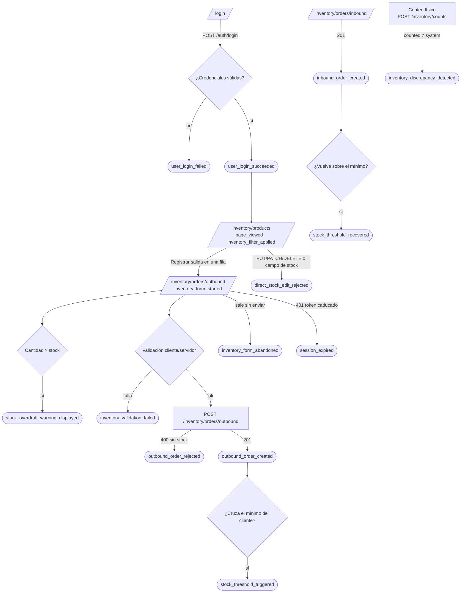

# Plan de telemetría de TrackFlow

Documento de diseño para instrumentar el backoffice (`uis/backoffice`) y la API (`services/api`). Responde al RFI de Dirección:
qué datos merece la pena capturar hoy, cuáles pueden ser valiosos mañana y cómo se capturan sin romper la regla de trazabilidad del
inventario ni filtrar datos personales. **No incluye código**: es el contrato que el equipo implementa.

El esquema validable de cada evento está en [`event-schemas.json`](./event-schemas.json) (JSON Schema draft-07). Este documento y el
JSON se generan desde la misma definición, así que las listas de propiedades coinciden.

## Contenido

1. [Resumen](#1-resumen)
2. [Punto de partida: qué existe hoy](#2-punto-de-partida-qué-existe-hoy)
3. [Flujo de inventario y puntos de instrumentación](#3-flujo-de-inventario-y-puntos-de-instrumentación)
4. [Catálogo de eventos](#4-catálogo-de-eventos)
5. [Hipótesis y decisiones](#5-hipótesis-y-decisiones)
6. [Event Envelope](#6-event-envelope)
7. [Emisión y transporte](#7-emisión-y-transporte)
8. [Estrategia de entrega: stream o batch](#8-estrategia-de-entrega-stream-o-batch)
9. [Throttle y debounce](#9-throttle-y-debounce)
10. [Privacidad, PII y retención](#10-privacidad-pii-y-retención)
11. [Riesgos y exclusiones](#11-riesgos-y-exclusiones)
12. [Referencia de eventos](#12-referencia-de-eventos)
13. [Guía de implementación](#13-guía-de-implementación)

---

## 1. Resumen

- **42 eventos** diseñados: **5 obligatorios** (las métricas que Operaciones y Dirección necesitan desde ya) y
  **37 oportunidades identificadas**.
- **Categorías:** negocio/inventario, autenticación y cuentas, rendimiento, errores y disponibilidad, navegación y UX, y otros módulos del
  backoffice (incidencias y proveedores).
- **Regla de oro aplicada a todos:** cada evento completa la frase *«Capturamos `event_type` porque necesitamos saber `hipótesis`, lo que
  nos permite tomar la decisión `decisión`»* ([sección 5](#5-hipótesis-y-decisiones)). Lo que no la completa está en
  [exclusiones](#11-riesgos-y-exclusiones).
- **Los cinco obligatorios los emite la API después del commit**, nunca el navegador: el dato de negocio sale de la misma transacción que
  cambia el inventario y se agrega por `warehouse`, `client_id` y `country` para el dashboard de operaciones de Ana y el ejecutivo de Thomas.
- **Dos piezas nuevas en la API** son requisito de dos obligatorios: el umbral mínimo por cliente con estado de alertas
  (`stock_threshold_triggered`) y el registro de conteos físicos `POST /inventory/counts` (`inventory_discrepancy_detected`).

## 2. Punto de partida: qué existe hoy

| Pieza | Estado actual | Qué aprovecha el plan |
|---|---|---|
| Inventario (`services/api/routes/inventory.py`) | SKUs, recepciones (`StockEntry`) y salidas (`StockExit`) en Supabase. El stock se calcula (entradas − salidas) por SKU y almacén; no hay columna de stock ni ruta para editarlo. Las salidas bloquean la fila del SKU (`FOR UPDATE`). | Puntos de emisión tras cada `commit`; el stock disponible ya calculado bajo bloqueo da `stock_after` sin consultas extra. |
| Logs | `trackflow.inventory`, `trackflow.api` y `trackflow.timing` (una línea por petición con ruta, estado y duración). | Los eventos se emiten junto a esos logs y comparten `requestId`. |
| Auth | JWT HS256 (30 min), usuarios en TinyDB con `role` `admin`/`manager`/`user`. El backoffice guarda el token en `localStorage` y `apiFetch` redirige a `/login` ante 401. | `userId` = `sub` del JWT; `session_expired` desde `apiFetch`. |
| Backoffice | Stock por SKU (filtro de almacén), formularios de entrada y salida con validación cliente y aviso de sobregiro, historial, incidencias, proveedores, perfil. Aviso de stock bajo con `LOW_STOCK_THRESHOLD = 50` en el frontend. | Eventos de UX, navegación y errores de cliente. |
| Telemetría | No existe: ni identificador de correlación, ni sesión, ni eventos estructurados. | Todo lo de este plan es nuevo. |

### Identificadores de negocio

Los eventos de inventario llevan siempre `warehouse`, `client_id`, `product_id`, `product_category` y `quantity`. Así se obtienen del
modelo actual:

| Propiedad | Origen en el sistema | Regla |
|---|---|---|
| `warehouse` | `Warehouse` (`LA`, `ZGZ`) | `LA` → `los_angeles`, `ZGZ` → `zaragoza`. |
| `country` | Derivado de `warehouse` | `los_angeles` → `US`, `zaragoza` → `ES`. Se incluye para agregar por país sin joins. |
| `client_id` | `SKU.client_name` | No existe tabla de clientes: slug determinista (NFKD → ASCII, minúsculas, todo lo que no sea `[a-z0-9]` → `-`, sin guiones repetidos ni en los extremos). `PureStep Footwear` → `purestep-footwear`. Ver riesgo R1. |
| `product_id` | `SKU.sku` | El código SKU, único en la red (`CLT-SNK-W-42`). Cada SKU pertenece a un único cliente, así que `product_id` nunca mezcla clientes. |
| `product_category` | `SKU.category` | `fashion`, `electronics`, `cosmetics` (moda, electrónica, cosmética). |
| `quantity` | Según el evento | Unidades del movimiento, stock resultante o diferencia; cada evento documenta su semántica. |

### Piezas nuevas que exigen los obligatorios

1. **Umbral mínimo por cliente.** Hoy solo existe un umbral global en el frontend. La API incorpora una configuración
   `STOCK_MIN_THRESHOLDS` (`client_id` → unidades) con valor por defecto 50, igual que `LOW_STOCK_THRESHOLD`, y una tabla
   `stock_threshold_alerts` en Supabase (una fila abierta por `product_id` + `warehouse` + nivel) para disparar por flanco, deduplicar y
   medir cuánto dura cada alerta. El backoffice deberá leer el umbral de la API para no divergir (riesgo R2).
2. **Conteo físico.** `POST /inventory/counts` registra un conteo (`sku_id`, `warehouse`, `counted_quantity`, `detection_method`) y lo
   compara con el stock calculado. **No modifica el stock**: la corrección se hace después con una entrada o una salida `loss`, trazable
   al usuario como el resto.
3. **Rechazo explícito de la edición directa.** Rutas `PUT`/`PATCH`/`DELETE` sobre `/inventory/products/{sku_id}`,
   `/inventory/products/{sku_id}/stock` y `/inventory/orders/**` que devuelven 405 con el mensaje «El stock solo cambia con órdenes de
   entrada o salida», en lugar del 405 genérico de FastAPI.

## 3. Flujo de inventario y puntos de instrumentación

Recorrido de un operador autenticado desde el acceso hasta que completa una orden, con los eventos que emite cada paso.



| # | Punto del flujo | Dónde se instrumenta | Evento(s) |
|---|---|---|---|
| 1 | Acceso al sistema | `POST /auth/login` | `user_login_succeeded`, `user_login_failed` |
| 2 | Consulta de stock y filtro por almacén | `InventoryStockTable` | `page_viewed`, `inventory_filter_applied` |
| 3 | Inicio de una orden | `StockEntryForm`, `StockExitForm` | `inventory_form_started` |
| 4 | Cantidad superior al stock (aviso UX) | `getOverdraftWarning` | `stock_overdraft_warning_displayed` |
| 5 | Validación fallida | `validateStock*` (cliente) y 422 de la API | `inventory_validation_failed` |
| 6 | Salida sin stock suficiente | `create_outbound_order`, rama 400 | `outbound_order_rejected` |
| 7 | Orden de entrada completada | `create_inbound_order`, tras `commit` | **`inbound_order_created`** |
| 8 | Orden de salida completada | `create_outbound_order`, tras `commit` | **`outbound_order_created`** |
| 9 | Activación del umbral mínimo | Tras la salida, con el stock resultante | **`stock_threshold_triggered`** |
| 10 | Recuperación del umbral | Tras la entrada | `stock_threshold_recovered` |
| 11 | Intento de modificar el stock directamente | Rutas 405 explícitas y `validation_error_handler` | **`direct_stock_edit_rejected`** |
| 12 | Conteo físico con diferencia | `POST /inventory/counts` | **`inventory_discrepancy_detected`** |
| 13 | Flujo abandonado o sesión caducada | Formularios y `apiFetch` | `inventory_form_abandoned`, `session_expired` |
| 14 | Foto diaria del stock | Job programado | `inventory_snapshot_recorded` |

En negrita, los obligatorios.

## 4. Catálogo de eventos

| # | `event_type` | Clasificación | Categoría | Emisor | Entrega |
|---|---|---|---|---|---|
| 1 | [`inbound_order_created`](#inbound_order_created) | Obligatorio | Negocio / inventario | api | batch (horario) |
| 2 | [`outbound_order_created`](#outbound_order_created) | Obligatorio | Negocio / inventario | api | stream |
| 3 | [`stock_threshold_triggered`](#stock_threshold_triggered) | Obligatorio | Negocio / inventario | api | stream |
| 4 | [`direct_stock_edit_rejected`](#direct_stock_edit_rejected) | Obligatorio | Negocio / inventario | api | batch (diario) |
| 5 | [`inventory_discrepancy_detected`](#inventory_discrepancy_detected) | Obligatorio | Negocio / inventario | api | batch (diario) |
| 6 | [`outbound_order_rejected`](#outbound_order_rejected) | Oportunidad identificada | Negocio / inventario | api | stream |
| 7 | [`inventory_validation_failed`](#inventory_validation_failed) | Oportunidad identificada | Negocio / inventario | api \| backoffice | batch (diario) |
| 8 | [`stock_threshold_recovered`](#stock_threshold_recovered) | Oportunidad identificada | Negocio / inventario | api | stream |
| 9 | [`product_created`](#product_created) | Oportunidad identificada | Negocio / inventario | api | batch (diario) |
| 10 | [`product_creation_rejected`](#product_creation_rejected) | Oportunidad identificada | Negocio / inventario | api | batch (diario) |
| 11 | [`inventory_snapshot_recorded`](#inventory_snapshot_recorded) | Oportunidad identificada | Negocio / inventario | job | batch (diario) |
| 12 | [`inventory_form_started`](#inventory_form_started) | Oportunidad identificada | Negocio / inventario | backoffice | batch (diario) |
| 13 | [`inventory_form_abandoned`](#inventory_form_abandoned) | Oportunidad identificada | Negocio / inventario | backoffice | batch (diario) |
| 14 | [`stock_overdraft_warning_displayed`](#stock_overdraft_warning_displayed) | Oportunidad identificada | Negocio / inventario | backoffice | batch (diario) |
| 15 | [`user_login_succeeded`](#user_login_succeeded) | Oportunidad identificada | Autenticación y cuentas | api | batch (diario) |
| 16 | [`user_login_failed`](#user_login_failed) | Oportunidad identificada | Autenticación y cuentas | api | stream |
| 17 | [`session_expired`](#session_expired) | Oportunidad identificada | Autenticación y cuentas | backoffice | batch (diario) |
| 18 | [`session_closed`](#session_closed) | Oportunidad identificada | Autenticación y cuentas | backoffice | batch (diario) |
| 19 | [`user_registered`](#user_registered) | Oportunidad identificada | Autenticación y cuentas | api | batch (horario) |
| 20 | [`password_reset_requested`](#password_reset_requested) | Oportunidad identificada | Autenticación y cuentas | api | batch (horario) |
| 21 | [`password_reset_completed`](#password_reset_completed) | Oportunidad identificada | Autenticación y cuentas | api | batch (diario) |
| 22 | [`password_reset_failed`](#password_reset_failed) | Oportunidad identificada | Autenticación y cuentas | api | batch (diario) |
| 23 | [`authorization_denied`](#authorization_denied) | Oportunidad identificada | Autenticación y cuentas | api | batch (diario) |
| 24 | [`user_role_changed`](#user_role_changed) | Oportunidad identificada | Autenticación y cuentas | api | batch (diario) |
| 25 | [`api_latency_recorded`](#api_latency_recorded) | Oportunidad identificada | Rendimiento | api | stream |
| 26 | [`page_load_recorded`](#page_load_recorded) | Oportunidad identificada | Rendimiento | backoffice | batch (diario) |
| 27 | [`cache_stats_recorded`](#cache_stats_recorded) | Oportunidad identificada | Rendimiento | api | batch (horario) |
| 28 | [`password_reset_email_failed`](#password_reset_email_failed) | Oportunidad identificada | Errores y disponibilidad | api | stream |
| 29 | [`api_error_occurred`](#api_error_occurred) | Oportunidad identificada | Errores y disponibilidad | api | stream |
| 30 | [`database_connection_failed`](#database_connection_failed) | Oportunidad identificada | Errores y disponibilidad | api | stream |
| 31 | [`api_call_failed`](#api_call_failed) | Oportunidad identificada | Errores y disponibilidad | backoffice | stream |
| 32 | [`frontend_error_captured`](#frontend_error_captured) | Oportunidad identificada | Errores y disponibilidad | backoffice | stream |
| 33 | [`error_retry_attempted`](#error_retry_attempted) | Oportunidad identificada | Errores y disponibilidad | backoffice | batch (diario) |
| 34 | [`inventory_filter_applied`](#inventory_filter_applied) | Oportunidad identificada | Navegación y UX | backoffice | batch (diario) |
| 35 | [`page_viewed`](#page_viewed) | Oportunidad identificada | Navegación y UX | backoffice | batch (diario) |
| 36 | [`sidebar_item_clicked`](#sidebar_item_clicked) | Oportunidad identificada | Navegación y UX | backoffice | batch (diario) |
| 37 | [`incident_created`](#incident_created) | Oportunidad identificada | Otros módulos del backoffice | api | batch (horario) |
| 38 | [`incident_status_changed`](#incident_status_changed) | Oportunidad identificada | Otros módulos del backoffice | api | batch (diario) |
| 39 | [`incident_csv_analyzed`](#incident_csv_analyzed) | Oportunidad identificada | Otros módulos del backoffice | api | batch (diario) |
| 40 | [`supplier_created`](#supplier_created) | Oportunidad identificada | Otros módulos del backoffice | api | batch (diario) |
| 41 | [`supplier_rate_updated`](#supplier_rate_updated) | Oportunidad identificada | Otros módulos del backoffice | api | batch (diario) |
| 42 | [`supplier_status_changed`](#supplier_status_changed) | Oportunidad identificada | Otros módulos del backoffice | api | batch (diario) |

**Obligatorio** = métrica exigida por Operaciones y Dirección; su nombre, sus identificadores y sus propiedades mínimas no se pueden
cambiar sin su aprobación. **Oportunidad identificada** = propuesta de Tecnología a partir del recorrido por la aplicación; se puede
priorizar o posponer.

## 5. Hipótesis y decisiones

**Obligatorios**

- Capturamos `inbound_order_created` porque necesitamos saber cuánto volumen entra, por cliente y por almacén, lo que nos permite planificar capacidad de almacén y personal según el volumen entrante (Ana).
- Capturamos `outbound_order_created` porque necesitamos saber cuántos pedidos se procesan, por cliente y almacén, y a qué ritmo, lo que nos permite detectar cuellos de botella operativos antes de que afecten el SLA de entrega (Ana).
- Capturamos `stock_threshold_triggered` porque necesitamos saber con qué frecuencia un cliente se queda sin stock disponible de un SKU, lo que nos permite alertar al cliente y al equipo comercial antes de un quiebre de stock (Miguel).
- Capturamos `direct_stock_edit_rejected` porque necesitamos saber si el personal de almacén intenta saltarse el control de trazabilidad, lo que nos permite reforzar capacitación o permisos en el almacén donde esto ocurre con más frecuencia.
- Capturamos `inventory_discrepancy_detected` porque necesitamos saber en qué SKUs y almacenes ocurren más discrepancias, lo que nos permite priorizar auditorías de inventario en los SKUs con mayor tasa de discrepancia (Ana).

**Negocio / inventario**

- Capturamos `outbound_order_rejected` porque necesitamos saber si hay salidas que no se pueden registrar porque el stock del sistema va por detrás del físico (recepciones sin registrar o descuadres), lo que nos permite revisar en el mismo turno si hay mercancía recibida sin registrar o lanzar un conteo del SKU.
- Capturamos `inventory_validation_failed` porque necesitamos saber qué productos, campos y formularios acumulan más errores de validación, lo que nos permite corregir el formulario o el dato maestro del SKU que más falla, o formar en ese paso.
- Capturamos `stock_threshold_recovered` porque necesitamos saber cuánto tiempo pasa un SKU por debajo del mínimo hasta que el cliente repone, lo que nos permite renegociar plazos de reposición con los clientes que más tardan (Miguel) y cerrar al momento las alertas ya enviadas.
- Capturamos `product_created` porque necesitamos saber a qué ritmo incorporan SKUs los clientes en cada almacén y cuántos se quedan sin primera recepción, lo que nos permite anticipar espacio de almacén por cliente y revisar altas que nunca reciben mercancía.
- Capturamos `product_creation_rejected` porque necesitamos saber si los operadores chocan con la convención de un código SKU por almacén (el mismo producto en LA y ZGZ exige sufijos como `-Z`), lo que nos permite formalizar la convención de códigos por almacén o cambiar el modelo para que un SKU exista en varios almacenes.
- Capturamos `inventory_snapshot_recorded` porque necesitamos saber cómo evoluciona el stock por cliente y almacén y qué SKUs no rotan, lo que nos permite proponer a los clientes retirar stock muerto y alimentar las tendencias del dashboard ejecutivo (Thomas).
- Capturamos `inventory_form_started` porque necesitamos saber desde dónde se inician las órdenes (menú lateral o fila de la tabla de stock) y cuántas se completan, lo que nos permite decidir qué accesos directos mantener y medir la conversión del formulario junto a `inventory_form_abandoned`.
- Capturamos `inventory_form_abandoned` porque necesitamos saber en qué paso se abandonan los flujos de entrada y salida, lo que nos permite rediseñar el campo o el paso donde más se abandona.
- Capturamos `stock_overdraft_warning_displayed` porque necesitamos saber si el aviso de UX evita los 400 por stock insuficiente o los operadores lo ignoran, lo que nos permite convertir el aviso en validación bloqueante si la mayoría de envíos avisados acaban en `outbound_order_rejected`.

**Autenticación y cuentas**

- Capturamos `user_login_succeeded` porque necesitamos saber cuántos usuarios activos hay por día, rol y navegador, lo que nos permite dimensionar licencias y soporte, y saber qué navegadores hay que soportar.
- Capturamos `user_login_failed` porque necesitamos saber cuántos intentos de login fallan por día y si alguno es un ataque de fuerza bruta o de relleno de credenciales, lo que nos permite bloquear temporalmente una IP o cuenta, o forzar el cambio de contraseña de una cuenta atacada.
- Capturamos `session_expired` porque necesitamos saber si el token de 30 minutos caduca en mitad del trabajo y hace perder formularios a medias, lo que nos permite ampliar `ACCESS_TOKEN_EXPIRE_MINUTES` o implementar refresh token.
- Capturamos `session_closed` porque necesitamos saber si los operadores cierran sesión en los puestos compartidos del almacén o las dejan abiertas hasta que caducan, lo que nos permite activar el cierre automático por inactividad en puestos compartidos.
- Capturamos `user_registered` porque necesitamos saber quién se registra en un backoffice cuyo registro es público y da acceso al inventario de los clientes, lo que nos permite cerrar el registro público o exigir aprobación de un admin.
- Capturamos `password_reset_requested` porque necesitamos saber cuántos usuarios pierden el acceso y si alguien abusa del endpoint para enviar correos, lo que nos permite limitar el endpoint por IP y revisar la cuota de Resend.
- Capturamos `password_reset_completed` porque necesitamos saber cuánto tardan los usuarios en usar el enlace de 30 minutos, lo que nos permite ajustar la caducidad del enlace.
- Capturamos `password_reset_failed` porque necesitamos saber si los enlaces fallan sobre todo por caducidad o por reutilización, lo que nos permite ampliar la ventana o mejorar la entregabilidad del correo.
- Capturamos `authorization_denied` porque necesitamos saber si hay usuarios que necesitan permisos que no tienen o que intentan escalar privilegios, lo que nos permite ajustar los roles o investigar a la cuenta que intenta cambiar su propio rol.
- Capturamos `user_role_changed` porque necesitamos saber cuántas cuentas tienen privilegios de admin o manager y quién los concede, lo que nos permite hacer la revisión periódica de accesos con datos en vez de a mano.

**Rendimiento**

- Capturamos `api_latency_recorded` porque necesitamos saber qué endpoints se degradan y cuándo, lo que nos permite avisar a guardia si el p95 supera el presupuesto y priorizar optimizaciones (paginación de `/inventory/orders`, Redis).
- Capturamos `page_load_recorded` porque necesitamos saber cómo rinde el backoffice en los equipos y redes reales de los almacenes, no en Lighthouse, lo que nos permite priorizar trabajo de rendimiento en las vistas y dispositivos que superen los umbrales de Web Vitals.
- Capturamos `cache_stats_recorded` porque necesitamos saber qué tasa de acierto tienen las cachés en producción y si con varios procesos deja de compensar, lo que nos permite ajustar TTL o pasar a Redis.

**Errores y disponibilidad**

- Capturamos `password_reset_email_failed` porque necesitamos saber si hay usuarios que no pueden recuperar el acceso por un fallo del proveedor o de configuración, lo que nos permite avisar a guardia para corregir la configuración de Resend (dominio, clave) antes de que se acumulen usuarios bloqueados.
- Capturamos `api_error_occurred` porque necesitamos saber qué rutas fallan en producción y con qué excepción, lo que nos permite abrir incidencia de guardia o revertir el último despliegue.
- Capturamos `database_connection_failed` porque necesitamos saber cuándo y cuánto tiempo el inventario está caído, lo que nos permite escalar a Supabase o activar el procedimiento de operación manual en almacén.
- Capturamos `api_call_failed` porque necesitamos saber qué fallos ve el usuario que la API no puede registrar (API caída, rewrite de Next roto, red del almacén), lo que nos permite avisar a guardia de una caída que los logs de la API no muestran.
- Capturamos `frontend_error_captured` porque necesitamos saber qué errores de cliente rompen vistas tras un despliegue, lo que nos permite revertir o corregir en caliente.
- Capturamos `error_retry_attempted` porque necesitamos saber si los errores que ven los usuarios son transitorios (el reintento funciona), lo que nos permite añadir reintento automático con espera en `useApiList`.

**Navegación y UX**

- Capturamos `inventory_filter_applied` porque necesitamos saber si cada operador trabaja casi siempre con su propio almacén, lo que nos permite preseleccionar el almacén del usuario en su perfil y ahorrar un paso en cada consulta.
- Capturamos `page_viewed` porque necesitamos saber qué secciones usan más los operadores y cuáles casi nadie, lo que nos permite priorizar el roadmap y retirar o rediseñar lo que no se usa.
- Capturamos `sidebar_item_clicked` porque necesitamos saber cuánta demanda real tienen los módulos que aún no existen (Devoluciones, Atención al cliente, Dashboard ejecutivo), lo que nos permite ordenar los próximos hitos por demanda observada.

**Otros módulos del backoffice**

- Capturamos `incident_created` porque necesitamos saber qué categorías y sedes concentran las incidencias, lo que nos permite reforzar procesos o personal donde se concentran.
- Capturamos `incident_status_changed` porque necesitamos saber cuánto se tarda en resolver cada categoría de incidencia, lo que nos permite fijar y vigilar un SLA de resolución para CX (Valentina).
- Capturamos `incident_csv_analyzed` porque necesitamos saber qué calidad tienen los CSV que exportan los sistemas de origen, lo que nos permite corregir el exportador en origen si la tasa de filas inválidas es alta.
- Capturamos `supplier_created` porque necesitamos saber si la base de proveedores depende de pocos transportistas por país y categoría, lo que nos permite diversificar transportistas donde hay dependencia de uno solo (Carlos).
- Capturamos `supplier_rate_updated` porque necesitamos saber cómo evolucionan las tarifas de transportistas por país, lo que nos permite renegociar o cambiar de proveedor cuando las subidas se acumulan.
- Capturamos `supplier_status_changed` porque necesitamos saber con qué frecuencia se suspenden proveedores y en qué país, lo que nos permite mantener alternativas activas en los países con más suspensiones.

## 6. Event Envelope

Todo evento, lo emita quien lo emita, es un objeto JSON con esta estructura. `additionalProperties: false`: no se admiten campos de
primer nivel distintos de estos.

| Campo | Tipo | Cómo se genera |
|---|---|---|
| `eventId` | UUID v4 | Lo genera el emisor al crear el evento. Es la clave de deduplicación: la entrega es *at-least-once*. |
| `timestamp` | string ISO 8601 UTC con milisegundos (`AAAA-MM-DDThh:mm:ss.sssZ`) | Momento del hecho, no del envío. En la API, el de la operación (para los eventos con outbox, el de la transacción). En el navegador, `new Date().toISOString()`; la ingesta rechaza eventos con más de 5 minutos en el futuro. |
| `sessionId` | UUID v4, `job:<nombre>:<uuid>` o `unknown` | El backoffice genera un UUID por pestaña (`sessionStorage`, clave `trackflow_session_id`) en la primera carga y lo rota al cerrar sesión o al caducar el token. Viaja a la API en la cabecera `X-Session-Id`. Los jobs usan `job:<nombre>:<uuid de ejecución>`; las peticiones sin cabecera (scripts, `/docs`), `unknown`. |
| `userId` | UUID, `anonymous` o `system:<job>` | En la API, `current_user.id` (el `sub` del JWT, id de TinyDB). Nunca el email. `anonymous` antes del login; `system:<job>` en procesos. En los eventos del navegador lo **sobrescribe la ingesta** con el usuario del token: el cliente no decide quién es. |
| `event_type` | string `^[a-z]+(_[a-z]+)+$` | `entidad_acción` en snake_case con un verbo del vocabulario de abajo. |
| `schemaVersion` | SemVer | Versión del esquema de ese `event_type` (todos empiezan en `1.0.0`). |
| `requestId` | UUID v4 | `apiFetch` genera uno por llamada y lo envía en `X-Request-Id`; el `timing_middleware` lo acepta si es un UUID válido o crea uno, lo guarda en un `contextvar`, lo devuelve en la respuesta y lo añade a las líneas de `trackflow.*`. Los eventos de la API usan el de la petición en curso; los del navegador sin llamada asociada, uno nuevo. Con él se unen evento, log y traza de un mismo 500. |
| `source` | `backoffice` \| `api` \| `job` | Emisor. |
| `environment` | `development` \| `staging` \| `production` | Variable `TELEMETRY_ENVIRONMENT`; evita mezclar pruebas con datos reales. |
| `properties` | objeto | Payload del evento. Solo claves de su allowlist ([sección 12](#12-referencia-de-eventos)). |

`source` y `environment` se añaden a los campos mínimos porque sin ellos no se puede filtrar el ruido de desarrollo ni saber qué emisor
falla.

### Taxonomía de `event_type`

- **Entidad** en singular y del dominio (`inbound_order`, `stock_threshold`, `user_login`, `api_call`), **acción** en participio pasado:
  el evento describe algo que ya ocurrió.
- **Vocabulario de verbos:** `created` (alta confirmada), `rejected` (la regla de negocio lo impidió), `failed` (error técnico o
  validación), `triggered` / `recovered` (entrada y salida de un umbral), `detected` (hallazgo de un control), `recorded` (medición),
  `started` / `abandoned` (flujos de UI), `displayed`, `applied`, `viewed`, `clicked` (UI), `succeeded`, `expired`, `closed`,
  `registered`, `requested`, `completed`, `denied`, `changed`, `updated`, `occurred`, `captured`, `attempted`, `analyzed`. Un verbo nuevo
  se añade aquí antes de usarlo.
- Pares consistentes: `*_created` / `*_rejected`, `*_succeeded` / `*_failed`, `*_triggered` / `*_recovered`, `*_started` / `*_abandoned`.

### Versionado

- Añadir una propiedad **opcional** → versión menor (`1.1.0`).
- Añadir una obligatoria, quitar o renombrar una, o cambiar un tipo → versión mayor (`2.0.0`). Durante la transición se emiten las dos
  versiones y los consumidores aceptan cualquier versión con su mismo número mayor.
- Cambiar el nombre de un `event_type` obligatorio no se hace: se crea uno nuevo y se depreca el anterior.

### Ejemplo

```json
{
  "eventId": "8f14e45f-ceea-4e7a-9a3b-2f1c6b0f9d11",
  "timestamp": "…",
  "sessionId": "1c8e2c7a-5b1d-4f3e-8a9c-0d2e4f6a8b10",
  "userId": "4b3f1c2d-9e8a-4d7c-b6a5-1f2e3d4c5b6a",
  "event_type": "outbound_order_created",
  "schemaVersion": "1.0.0",
  "requestId": "0f9e8d7c-6b5a-4c3d-9e1f-2a3b4c5d6e7f",
  "source": "api",
  "environment": "production",
  "properties": {
    "order_id": 42,
    "warehouse": "zaragoza",
    "country": "ES",
    "client_id": "soundwave-electronics",
    "product_id": "TEC-CHG-065",
    "product_category": "electronics",
    "quantity": 10,
    "exit_type": "dispatch",
    "stock_after": 45,
    "user_role": "user"
  }
}
```

## 7. Emisión y transporte

Aquí se fija el contrato de emisión, que no depende del almacenamiento; el estado de la ingesta y de la tabla `telemetry_events` está al final de la sección.

### API (`services/api`)

- Módulo nuevo `services/api/telemetry.py` con `emit(event_type, properties)`. Construye el envelope con los `contextvar` de la petición
  (`requestId`, `sessionId`, usuario), **filtra `properties` contra el allowlist** del esquema (una clave desconocida se descarta y se
  registra un `WARNING` en `trackflow.telemetry` con el nombre de la clave, nunca su valor) y valida el resultado con `event-schemas.json`.
- **Obligatorios con outbox transaccional:** `inbound_order_created`, `outbound_order_created`, `stock_threshold_triggered` e
  `inventory_discrepancy_detected` se insertan en una tabla `telemetry_outbox` dentro de la **misma transacción** que el movimiento. Si
  el `commit` falla no hay evento; si el proceso cae después del `commit`, el evento no se pierde. Un publicador lee el outbox y lo
  entrega. `direct_stock_edit_rejected` no escribe en inventario, así que se emite directamente.
- **El resto** se emite *fire-and-forget* a un logger `trackflow.telemetry` en JSON por línea. Un fallo de telemetría nunca cambia la
  respuesta al usuario ni hace rollback de una operación.
- CORS: añadir `X-Request-Id` y `X-Session-Id` a `allow_headers` y `X-Request-Id` a `expose_headers`.

### Backoffice (`uis/backoffice`)

- `lib/telemetry.ts` con `track(event_type, properties)`: cola en memoria que se envía en lote cada 10 s o al llegar a 20 eventos (lo
  que ocurra antes), y con `navigator.sendBeacon` cuando la pestaña se oculta (`visibilitychange`) o se cierra (`pagehide`). Si el envío
  falla, hasta 3 reintentos con espera exponencial (1 s, 2 s, 4 s) y después se descarta el lote. Tope de 200 eventos en cola (se
  descartan los más antiguos y se cuenta cuántos). La URL sale de `NEXT_PUBLIC_TELEMETRY_ENDPOINT`; el beacon viaja como `text/plain`
  para no necesitar preflight CORS si la ingesta es de otro origen.
- Ingesta en la API, no en `uis/` (las interfaces no tienen rutas de API): `POST /telemetry/events` en `services/api`, detrás del rewrite
  `/api/telemetry/*`. Acepta sin token solo los eventos de `/login`, `/register`, `/forgot-password` y `/reset-password`
  (`userId = anonymous`); para el resto exige Bearer y sobrescribe `userId`. Valida cada evento con `event-schemas.json` y rechaza el
  que no cumpla (sin tumbar el lote).
- **Un evento del navegador nunca sustituye a uno de la API.** Los obligatorios solo los emite la API; el navegador aporta contexto de UX.

### Estado de la implementación (captura)

| Pieza | Estado |
|---|---|
| `lib/telemetry.ts` (`TelemetryService` + `track()`) | Hecho, con el comportamiento de arriba. `track()` está tipado con `lib/telemetry-events.ts` (los 13 eventos de emisor `backoffice`); un test compara ese catálogo con `event-schemas.json`. |
| Correlación | Hecho: `apiFetch` envía `X-Request-Id` (uno por llamada) y `X-Session-Id`; `timing_middleware` los acepta si son UUID v4, los usa en los eventos de la API y devuelve `X-Request-Id`. |
| `services/api/telemetry.py` | Hecho: envelope, allowlist leído de `event-schemas.json`, solo eventos cuyo emisor incluye `api`. Entrega en el log `trackflow.telemetry`. No valida `properties` con JSON Schema en ejecución (lo hacen los tests). |
| Obligatorios | Emitidos por la API después del `commit`. Falta el outbox transaccional: si el proceso cae entre el `commit` y el log, el evento se pierde. |
| Umbral mínimo | `STOCK_MIN_THRESHOLDS` (JSON `client_id` → unidades, 50 por defecto). El disparo por flanco se calcula con el stock anterior y el resultante de la salida; la tabla `stock_threshold_alerts` (y con ella `stock_threshold_recovered`) queda para la fase de almacenamiento. |
| Conteo físico | `POST /inventory/counts` (tabla `inventory_counts`) y vista `/inventory/counts` en el backoffice. |
| `POST /telemetry/events` | **Ingesta real**: misma ruta y mismo sobre. Valida cada evento con `TelemetryEvent.model_validate` (más catálogo, emisor `backoffice` y reloj ±5 min), recorta `properties` al allowlist y guarda los válidos con un único bulk insert en `telemetry_events`; responde `{"received", "stored", "rejected"}`. Un evento inválido no tumba el lote. Todavía no exige token ni sobrescribe `userId`. La URL de la ingesta está en `TELEMETRY_ENDPOINT` (API) y `NEXT_PUBLIC_TELEMETRY_ENDPOINT` (backoffice). |
| `telemetry_events` (Supabase) | Una fila inmutable por evento: `id` (= `eventId`), `event_type`, `timestamp`, `service` (= `source`), `user_id`, `session_id`, `tags` (JSONB, `properties` filtrado) y `received_at`. Índices en `timestamp`, `event_type` y GIN en `tags`; trigger contra UPDATE/DELETE. Los eventos de la API llegan por el sumidero `ApiEventBuffer`, un insert por respuesta. |
| `GET /telemetry/report` | Reporte **técnico** (no de negocio) con Pandas en `services/telemetry/analysis.py`: volumen por día y emisor, tipos dominantes, tasa de fallos por tipo (`system` / `rejected`), p75 de Web Vitals por ruta y tasa diaria de fallos de login. Ventana `[start_date, end_date)` en UTC aplicada en SQL (7 días por defecto), caché de 60 s y vista `/telemetry` en el backoffice. `api_latency_recorded` todavía no se emite, así que la latencia es la de carga en el navegador. |

## 8. Estrategia de entrega: stream o batch

- **Stream:** el evento llega al pipeline en menos de 10 s y puede disparar una alerta. Se usa cuando la decisión que alimenta pierde
  valor en minutos: el almacén está parado, un cliente está a punto de quedarse sin stock o hay un ataque en curso.
- **Batch (horario):** carga cada hora. Para decisiones que se revisan varias veces al día.
- **Batch (diario):** carga una vez al día. Para tendencias, planificación y decisiones de producto.

| `event_type` | Entrega | Justificación (urgencia de la decisión) |
|---|---|---|
| `inbound_order_created` | batch (horario) | La planificación de capacidad y turnos se decide por turno o por día; ver el dato con una hora de retraso no cambia la decisión. |
| `outbound_order_created` | stream | Un cuello de botella se corrige dentro del mismo turno (reasignar personal, abrir otra línea de picking). Con datos horarios la alerta llega cuando el SLA ya se ha incumplido. |
| `stock_threshold_triggered` | stream | El valor de la alerta es la anticipación: el cliente necesita tiempo para reponer antes de que lleguen pedidos que no se podrán servir. Un retraso de horas convierte el aviso en un quiebre ya ocurrido. |
| `direct_stock_edit_rejected` | batch (diario) | La decisión (formación o permisos) se toma en la revisión semanal por almacén. El intento ya está bloqueado por la API, así que no hay daño que contener en tiempo real. |
| `inventory_discrepancy_detected` | batch (diario) | El plan de auditorías se prioriza una vez al día o a la semana con la tasa acumulada; un evento aislado no cambia esa decisión en minutos. La corrección de cada descuadre ya la hace quien cuenta, en el momento. |
| `outbound_order_rejected` | stream | El pedido está parado en el muelle mientras no se resuelva; la acción (registrar la recepción pendiente o contar) tiene que ocurrir en minutos. |
| `inventory_validation_failed` | batch (diario) | Alimenta mejoras de UX y de datos maestros que se planifican por sprint; no requiere reacción inmediata. |
| `stock_threshold_recovered` | stream | Cierra la alerta que el cliente y Comercial recibieron en tiempo real; si llega tarde, siguen gestionando un quiebre que ya no existe. |
| `product_created` | batch (diario) | Es una tendencia de semanas; se analiza en el informe diario. |
| `product_creation_rejected` | batch (diario) | Alimenta una decisión de modelo de datos, no una acción operativa. |
| `inventory_snapshot_recorded` | batch (diario) | Es una foto diaria por definición; sirve para tendencias, no para reaccionar. |
| `inventory_form_started` | batch (diario) | Métrica de UX que se analiza en agregado. |
| `inventory_form_abandoned` | batch (diario) | Decisión de diseño que se toma con semanas de datos. |
| `stock_overdraft_warning_displayed` | batch (diario) | Decisión de UX con datos agregados. |
| `user_login_succeeded` | batch (diario) | Métrica de adopción; no dispara acciones. |
| `user_login_failed` | stream | Un ataque de fuerza bruta se contiene en minutos; al día siguiente ya no sirve de nada. |
| `session_expired` | batch (diario) | Cambio de configuración o de diseño que se decide con datos de varios días. |
| `session_closed` | batch (diario) | Política de seguridad que se revisa con tendencias. |
| `user_registered` | batch (horario) | Riesgo de acceso indebido: basta revisarlo cada hora, porque las cuentas nuevas tienen rol `user`. |
| `password_reset_requested` | batch (horario) | El abuso se detecta con recuentos por hora; la cuota del proveedor no se agota en minutos. |
| `password_reset_completed` | batch (diario) | Ajuste de configuración. |
| `password_reset_failed` | batch (diario) | Ajuste de configuración. |
| `authorization_denied` | batch (diario) | Revisión de permisos periódica; la API ya bloquea el acceso. |
| `user_role_changed` | batch (diario) | Auditoría periódica. |
| `api_latency_recorded` | stream | La operación es 24/7 en dos husos horarios: una degradación del inventario frena el almacén que esté en turno y hay que verla en minutos. |
| `page_load_recorded` | batch (diario) | El backlog de rendimiento se prioriza por sprint. |
| `cache_stats_recorded` | batch (horario) | Decisión de arquitectura. |
| `password_reset_email_failed` | stream | Cada fallo es un usuario sin acceso a su puesto; un error de configuración afecta a todos a la vez. |
| `api_error_occurred` | stream | Un 500 es una operación de almacén que no se pudo hacer; guardia tiene que saberlo en minutos. |
| `database_connection_failed` | stream | Sin base de datos no se registra ninguna entrada ni salida: el almacén se para. |
| `api_call_failed` | stream | Es la única señal cuando la API está caída del todo; tiene que llegar en minutos. |
| `frontend_error_captured` | stream | Una vista rota tras un despliegue bloquea a todo un turno; la decisión de revertir se toma en minutos. |
| `error_retry_attempted` | batch (diario) | Decisión de diseño. |
| `inventory_filter_applied` | batch (diario) | Decisión de UX. |
| `page_viewed` | batch (diario) | Decisión de producto con datos de semanas. |
| `sidebar_item_clicked` | batch (diario) | Decisión de roadmap. |
| `incident_created` | batch (horario) | Los picos por sede se revisan varias veces al día; no hace falta reaccionar en segundos. |
| `incident_status_changed` | batch (diario) | El SLA se mide por día y por semana. |
| `incident_csv_analyzed` | batch (diario) | Mejora de calidad de datos a medio plazo. |
| `supplier_created` | batch (diario) | Decisión de compras. |
| `supplier_rate_updated` | batch (diario) | Decisión de compras. |
| `supplier_status_changed` | batch (diario) | Decisión de compras. |

## 9. Throttle y debounce

Solo necesitan control los eventos que pueden repetirse muchas veces por segundo o dispararse en ráfaga durante una caída. **Ningún
evento obligatorio se muestrea**: su valor está en contarlos todos.

| Evento | Riesgo de volumen | Estrategia |
|---|---|---|
| `api_latency_recorded` | Uno por petición; las pantallas de stock piden SKUs y detalles continuamente. | Muestreo: 100 % de respuestas ≥ 500 y ≥ 1.000 ms; 10 % del resto, con `sample_rate` para reponderar. Excluye `GET /` (health check de Docker). |
| `cache_stats_recorded` | Un acierto de caché por petición. | Contadores en memoria y un evento agregado por caché y proceso cada 60 s. |
| `page_viewed` | Redirecciones encadenadas (`/inventory` → `/inventory/products`, 401 → `/login`). | Debounce de 1 s: solo cuenta la ruta final. |
| `inventory_filter_applied` | Cambios rápidos del `<select>`. | Debounce de 500 ms. |
| `stock_overdraft_warning_displayed` | Se recalcula en cada pulsación de la cantidad. | Debounce de 1 s y una vez por combinación SKU + cantidad. |
| `api_call_failed` | Con la API caída, cada vista reintenta. | Uno por (`api_route`, `status_code`) y sesión cada 30 s; el resto suma en `suppressed_count`. |
| `frontend_error_captured` | Un error en un render se repite en bucle. | Uno por `fingerprint` y sesión cada 60 s; máximo 20 por sesión y hora. |
| `database_connection_failed` | Todas las peticiones de inventario fallan a la vez. | Uno por proceso cada 30 s con `suppressed_count`. |
| `stock_threshold_triggered` | Varias salidas seguidas con el SKU ya bajo mínimo. | Disparo por flanco con estado en `stock_threshold_alerts`: un evento por nivel hasta que se recupera. No es muestreo: no se pierde ninguna alerta. |
| `user_login_failed` | Un ataque genera cientos por minuto. | Sin muestreo (cada intento cuenta para detectar el ataque). Si una misma `ip_prefix` supera 100 por minuto, se agrega en un evento por minuto con `suppressed_count` en la siguiente versión menor. |

## 10. Privacidad, PII y retención

TrackFlow opera en España (RGPD) y en Estados Unidos (CCPA). Principios:

1. **Allowlist, no denylist.** Solo viajan las claves listadas por evento; todo lo demás se descarta en origen y en la ingesta.
2. **Nunca se copian cuerpos de petición, mensajes de error ni stacks**: pueden llevar contraseñas, tokens o texto libre.
3. **Ningún dato del consumidor final ni del transportista** en eventos de inventario: sin destinatario, dirección ni `tracking_number`.
4. **Rutas como plantilla** (`/inventory/products/{sku_id}`), nunca la URL real con ids o query string.

| Dato | Dónde aparecería | Tratamiento |
|---|---|---|
| `userId` (id de TinyDB) | Envelope | Seudónimo: no es el email, pero es dato personal porque se puede vincular. Se conserva porque la trazabilidad por usuario es un requisito. Acceso restringido y borrado por `userId` si el empleado lo solicita. |
| Email | Login fallido, recuperación, registro | Nunca en claro. HMAC-SHA256 con clave `TELEMETRY_HASH_KEY` (guardada fuera del almacén de eventos), truncado a 16 hex (`email_hash`). En el registro, solo el HMAC del dominio. |
| IP | Login fallido, recuperación | Truncada a /24 (IPv4) o /48 (IPv6) en `ip_prefix`. |
| User-Agent | Login correcto y fallido | Reducido a familia + versión mayor (`ua_family`). |
| `reference` del albarán | Recepciones | No se captura. |
| `tracking_number` | Salidas | No se captura (dominio de última milla). |
| Título, descripción y `reported_by` de incidencias | Incidencias | No se capturan (texto libre y email). |
| `contact_email`, `notes` de proveedores | Proveedores | No se capturan. |
| Contenido del CSV analizado | Análisis de incidencias | Solo recuentos. |
| Valores de formularios | Eventos de UX | Solo nombres de campo y contadores. |
| Tarifas de proveedores, nombre del cliente | Proveedores, inventario | No son PII, pero son confidenciales: mismo control de acceso que el backoffice. |

**Retención propuesta:** eventos de negocio de inventario, 25 meses (comparación interanual en el dashboard ejecutivo); eventos de
autenticación con `email_hash` o `ip_prefix`, 90 días; resto de eventos técnicos, 90 días en bruto y agregados sin `userId` después.

## 11. Riesgos y exclusiones

### Eventos considerados y descartados

| Evento | Motivo del descarte |
|---|---|
| `product_viewed` (cada `GET /inventory/products/{id}`) | El formulario de salida lo pide al elegir SKU: mide clics en un selector, no interés. La latencia ya la cubre `api_latency_recorded`. |
| `inventory_history_viewed`, `stock_table_viewed` | Redundantes con `page_viewed`. |
| `record_search_performed`, `carrier_simulation_run`, KPIs del panel `/` | El panel de operaciones funciona con datos de ejemplo (`lib/sample-data.ts`): mediría búsquedas sobre datos ficticios. Se revisará cuando la API sustituya esos datos. |
| `password_changed`, `profile_updated` | No hay decisión que alimenten; el log de la API basta para soporte. |
| `supplier_deleted` | Poco frecuente y sin decisión asociada; queda en el log. |
| `form_field_changed` (cada campo) | Coste alto y riesgo de capturar valores; `inventory_form_abandoned` da el último campo, que es lo que se necesita. |
| `outbound_order_picking_started` | Sería el dato para medir el tiempo de picking y el SLA, pero hoy el sistema solo registra el despacho. Queda como oportunidad futura (R6). |
| `incident_viewed` | Sin hipótesis: el tablero se consulta por rutina, no por una decisión. |

### Datos que no se capturan

- Grabación de sesión, mapas de calor y movimientos del ratón: coste alto y alto riesgo de capturar datos de clientes en pantalla.
- Cuerpos completos de petición y respuesta, mensajes de excepción y stacks.
- Emails, IP completas, User-Agent completo, tokens (de sesión o de recuperación).
- Datos del destinatario final y del transportista (proyecto de tracking de última milla).

### Riesgos

| # | Riesgo | Mitigación |
|---|---|---|
| R1 | `client_id` se deriva de `client_name`: renombrar una marca rompe su serie histórica y dos grafías del mismo cliente crean dos `client_id`. | Normalizar al emitir con una función única y cubrirla con tests. Cuando exista una tabla de clientes, usar su id con un cambio de versión mayor y una tabla de equivalencias. |
| R2 | El umbral vive hoy en el frontend (`LOW_STOCK_THRESHOLD = 50`); si la API usa mínimos por cliente, la tabla de stock y las alertas pueden no coincidir. | La API es la fuente del umbral; el backoffice lo lee de `GET /inventory/products` (campo nuevo) antes de activar los mínimos por cliente. |
| R3 | Ediciones hechas directamente en Supabase (SQL o panel) no pasan por la API: `direct_stock_edit_rejected` no las ve. | Restringir la escritura en Supabase al rol de la API y evaluar auditoría a nivel de base de datos (triggers o `pgaudit`). Queda fuera de este plan. |
| R4 | Los eventos del navegador se pueden falsificar. | Ingesta con validación de esquema, `userId` tomado del token y obligatorios emitidos solo por la API. |
| R5 | Las métricas en memoria (`cache_stats_recorded`, throttles) son por proceso: con varias réplicas hay que sumar por `instance_id`. | Documentado en el evento; los paneles agregan por `instance_id`. |
| R6 | El SLA de preparación no se puede medir: solo existe el momento del despacho. | Proponer a Operaciones un estado de picking en `StockExit` en el siguiente hito. |
| R7 | Relojes desincronizados en los puestos de almacén alteran `timestamp` en eventos del navegador. | La ingesta rechaza eventos con más de 5 minutos en el futuro y guarda su propia hora de recepción en el almacenamiento (no en el envelope). Los obligatorios usan la hora del servidor. |
| R8 | El outbox añade una escritura a cada movimiento de stock. | Una fila pequeña en la misma transacción; se medirá con `api_latency_recorded` en `POST /inventory/orders/*` antes y después. |
| R9 | El registro público (`POST /users`) da acceso al inventario a cualquiera. | Lo hace visible `user_registered`; la decisión de cerrarlo es de Dirección/CTO. |

## 12. Referencia de eventos

Cada tabla es el **allowlist** del evento: ninguna otra clave puede viajar en `properties`. Los tipos `enum warehouse`, `enum country`,
`slug`, `string (SKU)`, `enum category`, `enum role`, `enum method`, `route`, `hash` y `uuid` están definidos en `definitions` de
[`event-schemas.json`](./event-schemas.json).

### Obligatorios

#### inbound_order_created

Un almacén registra la recepción de mercancía de un cliente (StockEntry confirmada).

- **Clasificación:** Obligatorio · **Categoría:** Negocio / inventario · **Emisor:** api · **Entrega:** batch (horario) · **schemaVersion:** `1.0.0`
- **Disparador:** `POST /inventory/orders/inbound` → 201 en `create_inbound_order` (`services/api/routes/inventory.py`). La fila del outbox de telemetría se inserta en la misma transacción que la `StockEntry`: el evento solo existe si el `commit` se confirma.
- **Allowlist:** `order_id`, `warehouse`, `country`, `client_id`, `product_id`, `product_category`, `quantity`, `user_role`. Cualquier otra clave se descarta.
- **PII / sanitización:** Ninguno en `properties`. `reference` (albarán) no se captura: puede contener datos del remitente y no alimenta ninguna decisión.

| Propiedad | Tipo | Obligatoria | Descripción |
|---|---|---|---|
| `order_id` | integer | sí | `StockEntry.id`; une el evento con el historial de movimientos. |
| `warehouse` | enum warehouse | sí | Almacén del movimiento. |
| `country` | enum country | sí | Derivado de `warehouse`; permite agregar por país sin joins. |
| `client_id` | slug | sí | Marca dueña del SKU. |
| `product_id` | string (SKU) | sí | Código SKU. |
| `product_category` | enum category | sí | Categoría del SKU. |
| `quantity` | integer | sí | Unidades recibidas (> 0). |
| `user_role` | enum role | sí | Rol de quien registra; segmenta el volumen por tipo de usuario. |

#### outbound_order_created

Un almacén completa el picking y despacho de un pedido (StockExit confirmada).

- **Clasificación:** Obligatorio · **Categoría:** Negocio / inventario · **Emisor:** api · **Entrega:** stream · **schemaVersion:** `1.0.0`
- **Disparador:** `POST /inventory/orders/outbound` → 201 en `create_outbound_order`. La fila del outbox se inserta en la misma transacción que la `StockExit`, después de comprobar el stock con la fila bloqueada.
- **Allowlist:** `order_id`, `warehouse`, `country`, `client_id`, `product_id`, `product_category`, `quantity`, `exit_type`, `stock_after`, `user_role`. Cualquier otra clave se descarta.
- **PII / sanitización:** Ninguno. `tracking_number` y cualquier dato del destinatario quedan fuera: pertenecen al dominio de última milla.

| Propiedad | Tipo | Obligatoria | Descripción |
|---|---|---|---|
| `order_id` | integer | sí | `StockExit.id`. |
| `warehouse` | enum warehouse | sí | Almacén del movimiento. |
| `country` | enum country | sí | Derivado de `warehouse`; permite agregar por país sin joins. |
| `client_id` | slug | sí | Marca dueña del SKU. |
| `product_id` | string (SKU) | sí | Código SKU. |
| `product_category` | enum category | sí | Categoría del SKU. |
| `quantity` | integer | sí | Unidades despachadas o dadas de baja (> 0). |
| `exit_type` | `dispatch` \| `loss` | sí | `dispatch` = pedido despachado (el que cuenta para ritmo y SLA); `loss` = baja por pérdida. |
| `stock_after` | integer | sí | Stock del SKU en ese almacén tras la salida (`available − quantity`, ya calculado con la fila bloqueada; sin consulta extra). |
| `user_role` | enum role | sí | Rol de quien registra. |

#### stock_threshold_triggered

El stock de un SKU cae por debajo del mínimo configurado para su cliente.

- **Clasificación:** Obligatorio · **Categoría:** Negocio / inventario · **Emisor:** api · **Entrega:** stream · **schemaVersion:** `1.0.0`
- **Disparador:** En la transacción de una salida (outbox), si `previous_quantity ≥ threshold` y `quantity < threshold` (nivel `low`), o si `previous_quantity > 0` y `quantity = 0` (nivel `out`). Disparo por flanco: como máximo un evento abierto por (`product_id`, `warehouse`, `stock_level`) hasta que llegue `stock_threshold_recovered`.
- **Allowlist:** `warehouse`, `country`, `client_id`, `product_id`, `product_category`, `quantity`, `threshold`, `threshold_source`, `stock_level`, `previous_quantity`, `triggering_order_id`. Cualquier otra clave se descarta.
- **PII / sanitización:** Ninguno.

| Propiedad | Tipo | Obligatoria | Descripción |
|---|---|---|---|
| `warehouse` | enum warehouse | sí | Almacén del movimiento. |
| `country` | enum country | sí | Derivado de `warehouse`; permite agregar por país sin joins. |
| `client_id` | slug | sí | Marca dueña del SKU. |
| `product_id` | string (SKU) | sí | Código SKU. |
| `product_category` | enum category | sí | Categoría del SKU. |
| `quantity` | integer | sí | Stock disponible tras el movimiento que cruzó el umbral (≥ 0). |
| `threshold` | integer | sí | Mínimo aplicado a ese cliente. |
| `threshold_source` | `client_config` \| `default` | sí | `client_config` si el cliente tiene mínimo propio; `default` si se aplicó el valor por defecto (50). |
| `stock_level` | `low` \| `out` | sí | `low` = por debajo del mínimo; `out` = sin stock. |
| `previous_quantity` | integer | sí | Stock antes del movimiento. |
| `triggering_order_id` | integer | sí | `StockExit.id` que provocó el cruce. |

#### direct_stock_edit_rejected

Un usuario intenta modificar el stock fuera de una orden de entrada/salida y la API lo rechaza.

- **Clasificación:** Obligatorio · **Categoría:** Negocio / inventario · **Emisor:** api · **Entrega:** batch (diario) · **schemaVersion:** `1.0.0`
- **Disparador:** Tres vectores, todos en la API: (1) `PUT`/`PATCH`/`DELETE` sobre `/inventory/products/{sku_id}`, `/inventory/products/{sku_id}/stock` o `/inventory/orders/**` → 405 explícito con mensaje «El stock solo cambia con órdenes de entrada o salida»; (2) un `POST /inventory/*` cuyo cuerpo trae `current_stock`, `stock` o `stock_by_warehouse` → 422 `extra_forbidden`; (3) un `POST /inventory/*` que trae `user_uuid` (intento de atribuir el movimiento a otro usuario) → 422. Los vectores 2 y 3 se detectan en `validation_error_handler` inspeccionando `loc` de los errores `extra_forbidden`.
- **Allowlist:** `warehouse`, `country`, `client_id`, `product_id`, `product_category`, `quantity`, `attempt_type`, `http_method`, `route`, `http_status`, `rejected_field`, `target_resolved`, `user_role`. Cualquier otra clave se descarta.
- **PII / sanitización:** Ninguno. Nunca se copia el cuerpo de la petición: solo el nombre del campo prohibido y, si es un entero, su valor.

| Propiedad | Tipo | Obligatoria | Descripción |
|---|---|---|---|
| `warehouse` | enum warehouse \| null | sí | Almacén del movimiento. `null` si no se pudo resolver. |
| `country` | enum country \| null | sí | Derivado de `warehouse`; permite agregar por país sin joins. |
| `client_id` | slug \| null | sí | Marca dueña del SKU. |
| `product_id` | string (SKU) \| null | sí | Código SKU. |
| `product_category` | enum category \| null | sí | Categoría del SKU. |
| `quantity` | integer \| null | sí | Valor de stock que se intentó fijar, si venía en el cuerpo y era un entero; `null` si no había valor (p. ej. un `DELETE`). |
| `attempt_type` | `method_not_allowed` \| `stock_field_in_payload` \| `user_field_in_payload` | sí | Vector del intento. |
| `http_method` | enum method | sí | Método de la petición rechazada. |
| `route` | route | sí | Plantilla de la ruta atacada. |
| `http_status` | `405` \| `422` | sí | Respuesta devuelta. |
| `rejected_field` | `current_stock` \| `stock` \| `stock_by_warehouse` \| `user_uuid` \| null | sí | Campo prohibido detectado; `null` en `method_not_allowed`. |
| `target_resolved` | boolean | sí | `true` si el SKU objetivo se resolvió (por `sku_id` de la ruta o del cuerpo, o por `sku` en un alta). Si es `false`, los campos de producto van a `null`. |
| `user_role` | enum role | sí | Rol de quien lo intenta: separa errores de un integrador de intentos del personal. |

#### inventory_discrepancy_detected

Un conteo físico o una auditoría encuentra una diferencia entre el stock del sistema y el real.

- **Clasificación:** Obligatorio · **Categoría:** Negocio / inventario · **Emisor:** api · **Entrega:** batch (diario) · **schemaVersion:** `1.0.0`
- **Disparador:** Nuevo endpoint `POST /inventory/counts` (`sku_id`, `warehouse`, `counted_quantity`, `detection_method`): la API calcula el stock con la fila del SKU bloqueada, guarda el conteo y, si `counted ≠ system`, emite el evento. El conteo no toca el stock: la corrección se registra después con una entrada o una salida `loss`, como exige la regla de trazabilidad.
- **Allowlist:** `count_id`, `warehouse`, `country`, `client_id`, `product_id`, `product_category`, `quantity`, `system_quantity`, `counted_quantity`, `detection_method`, `discrepancy_ratio`. Cualquier otra clave se descarta.
- **PII / sanitización:** Ninguno.

| Propiedad | Tipo | Obligatoria | Descripción |
|---|---|---|---|
| `count_id` | integer | sí | Id del conteo registrado. |
| `warehouse` | enum warehouse | sí | Almacén del movimiento. |
| `country` | enum country | sí | Derivado de `warehouse`; permite agregar por país sin joins. |
| `client_id` | slug | sí | Marca dueña del SKU. |
| `product_id` | string (SKU) | sí | Código SKU. |
| `product_category` | enum category | sí | Categoría del SKU. |
| `quantity` | integer ≠ 0 | sí | Diferencia con signo `counted_quantity − system_quantity` (≠ 0): negativa = falta mercancía. |
| `system_quantity` | integer | sí | Stock calculado por el sistema en el momento del conteo. |
| `counted_quantity` | integer | sí | Unidades contadas físicamente. |
| `detection_method` | `cycle_count` \| `audit` | sí | Conteo cíclico del turno o auditoría programada. |
| `discrepancy_ratio` | number | sí | `|quantity| / max(system_quantity, 1)`; permite comparar SKUs de volúmenes distintos. |

### Negocio / inventario

#### outbound_order_rejected

La API rechaza una salida por stock insuficiente (400).

- **Clasificación:** Oportunidad identificada · **Categoría:** Negocio / inventario · **Emisor:** api · **Entrega:** stream · **schemaVersion:** `1.0.0`
- **Disparador:** Rama `payload.quantity > available` de `create_outbound_order`, junto al `logger.warning` actual.
- **Allowlist:** `warehouse`, `country`, `client_id`, `product_id`, `product_category`, `quantity`, `available_quantity`, `exit_type`. Cualquier otra clave se descarta.
- **PII / sanitización:** Ninguno.

| Propiedad | Tipo | Obligatoria | Descripción |
|---|---|---|---|
| `warehouse` | enum warehouse | sí | Almacén del movimiento. |
| `country` | enum country | sí | Derivado de `warehouse`; permite agregar por país sin joins. |
| `client_id` | slug | sí | Marca dueña del SKU. |
| `product_id` | string (SKU) | sí | Código SKU. |
| `product_category` | enum category | sí | Categoría del SKU. |
| `quantity` | integer | sí | Unidades solicitadas. |
| `available_quantity` | integer | sí | Stock disponible en ese almacén en el momento del rechazo. |
| `exit_type` | `dispatch` \| `loss` | sí | Tipo de salida intentada. |

#### inventory_validation_failed

Un alta de SKU o una orden de entrada/salida no supera la validación (cliente o servidor).

- **Clasificación:** Oportunidad identificada · **Categoría:** Negocio / inventario · **Emisor:** api | backoffice · **Entrega:** batch (diario) · **schemaVersion:** `1.0.0`
- **Disparador:** Servidor: 422 de `POST /inventory/products`, `/inventory/orders/inbound` u `/orders/outbound` que no sea `direct_stock_edit_rejected`. Cliente: `validateStockEntry`/`validateStockExit` devuelven errores al enviar el formulario.
- **Allowlist:** `layer`, `operation`, `product_id`, `warehouse`, `client_id`, `error_fields`, `error_types`, `error_count`. Cualquier otra clave se descarta.
- **PII / sanitización:** Ninguno: se registran nombres de campo y tipos de error, nunca el valor enviado.

| Propiedad | Tipo | Obligatoria | Descripción |
|---|---|---|---|
| `layer` | `client` \| `server` | sí | Dónde falló la validación. |
| `operation` | `product_create` \| `inbound_order` \| `outbound_order` | sí | Operación que falló. |
| `product_id` | string (SKU) \| null | sí | SKU si se pudo resolver desde `sku_id` o `sku`; si no, `null`. |
| `warehouse` | enum warehouse \| null | sí | Almacén del cuerpo si era válido. |
| `client_id` | slug \| null | sí | Cliente del SKU resuelto. |
| `error_fields` | array<string> | sí | Rutas de campo con error (`quantity`, `tracking_number`…), sin valores. |
| `error_types` | array<string> | sí | Tipos de error de Pydantic o del validador del cliente (`greater_than`, `missing`, `value_error`…). |
| `error_count` | integer | sí | Número de errores. |

#### stock_threshold_recovered

Un SKU con alerta abierta vuelve a superar el mínimo tras una recepción.

- **Clasificación:** Oportunidad identificada · **Categoría:** Negocio / inventario · **Emisor:** api · **Entrega:** stream · **schemaVersion:** `1.0.0`
- **Disparador:** Tras el commit de una entrada, si existe alerta abierta para (`product_id`, `warehouse`) y `quantity ≥ threshold`. Cierra la alerta en la tabla `stock_threshold_alerts`, que también sirve para deduplicar `stock_threshold_triggered`.
- **Allowlist:** `warehouse`, `country`, `client_id`, `product_id`, `product_category`, `quantity`, `threshold`, `previous_stock_level`, `duration_below_threshold_s`, `triggering_order_id`. Cualquier otra clave se descarta.
- **PII / sanitización:** Ninguno.

| Propiedad | Tipo | Obligatoria | Descripción |
|---|---|---|---|
| `warehouse` | enum warehouse | sí | Almacén del movimiento. |
| `country` | enum country | sí | Derivado de `warehouse`; permite agregar por país sin joins. |
| `client_id` | slug | sí | Marca dueña del SKU. |
| `product_id` | string (SKU) | sí | Código SKU. |
| `product_category` | enum category | sí | Categoría del SKU. |
| `quantity` | integer | sí | Stock tras la recepción. |
| `threshold` | integer | sí | Mínimo aplicado. |
| `previous_stock_level` | `low` \| `out` | sí | Nivel de la alerta que se cierra. |
| `duration_below_threshold_s` | integer | sí | Segundos desde el `stock_threshold_triggered` que abrió la alerta. |
| `triggering_order_id` | integer | sí | `StockEntry.id` que la cerró. |

#### product_created

Se da de alta un SKU nuevo.

- **Clasificación:** Oportunidad identificada · **Categoría:** Negocio / inventario · **Emisor:** api · **Entrega:** batch (diario) · **schemaVersion:** `1.0.0`
- **Disparador:** `POST /inventory/products` → 201, tras el commit en `create_product`.
- **Allowlist:** `warehouse`, `country`, `client_id`, `product_id`, `product_category`. Cualquier otra clave se descarta.
- **PII / sanitización:** Ninguno. El nombre comercial del producto (`name`) no se captura: no aporta a la decisión.

| Propiedad | Tipo | Obligatoria | Descripción |
|---|---|---|---|
| `warehouse` | enum warehouse | sí | Almacén del SKU. |
| `country` | enum country | sí | País. |
| `client_id` | slug | sí | Marca. |
| `product_id` | string (SKU) | sí | Código SKU. |
| `product_category` | enum category | sí | Categoría. |

#### product_creation_rejected

El alta de un SKU se rechaza porque el código ya existe (409).

- **Clasificación:** Oportunidad identificada · **Categoría:** Negocio / inventario · **Emisor:** api · **Entrega:** batch (diario) · **schemaVersion:** `1.0.0`
- **Disparador:** Las dos ramas 409 de `create_product` (comprobación previa e `IntegrityError`).
- **Allowlist:** `warehouse`, `client_id`, `product_id`, `product_category`, `existing_warehouse`. Cualquier otra clave se descarta.
- **PII / sanitización:** Ninguno.

| Propiedad | Tipo | Obligatoria | Descripción |
|---|---|---|---|
| `warehouse` | enum warehouse | sí | Almacén del alta intentada. |
| `client_id` | slug | sí | Marca del alta intentada. |
| `product_id` | string (SKU) | sí | Código duplicado. |
| `product_category` | enum category | sí | Categoría. |
| `existing_warehouse` | enum warehouse | sí | Almacén del SKU que ya tenía ese código. |

#### inventory_snapshot_recorded

Foto diaria del stock de cada SKU en su almacén.

- **Clasificación:** Oportunidad identificada · **Categoría:** Negocio / inventario · **Emisor:** job · **Entrega:** batch (diario) · **schemaVersion:** `1.0.0`
- **Disparador:** Job diario tras el cierre del turno de Zaragoza y antes del de Los Ángeles (una ejecución, un evento por SKU). `userId = system:inventory_snapshot`.
- **Allowlist:** `warehouse`, `country`, `client_id`, `product_id`, `product_category`, `quantity`, `threshold`, `stock_level`, `days_since_last_outbound`. Cualquier otra clave se descarta.
- **PII / sanitización:** Ninguno.

| Propiedad | Tipo | Obligatoria | Descripción |
|---|---|---|---|
| `warehouse` | enum warehouse | sí | Almacén del movimiento. |
| `country` | enum country | sí | Derivado de `warehouse`; permite agregar por país sin joins. |
| `client_id` | slug | sí | Marca dueña del SKU. |
| `product_id` | string (SKU) | sí | Código SKU. |
| `product_category` | enum category | sí | Categoría del SKU. |
| `quantity` | integer | sí | Stock al cierre. |
| `threshold` | integer | sí | Mínimo vigente. |
| `stock_level` | `healthy` \| `low` \| `out` | sí | Nivel según el mínimo. |
| `days_since_last_outbound` | integer \| null | sí | Días desde la última salida `dispatch`; `null` si nunca tuvo. |

#### inventory_form_started

Un operador empieza a rellenar el formulario de entrada o de salida.

- **Clasificación:** Oportunidad identificada · **Categoría:** Negocio / inventario · **Emisor:** backoffice · **Entrega:** batch (diario) · **schemaVersion:** `1.0.0`
- **Disparador:** Primer `focus` o `change` en `StockEntryForm` o `StockExitForm`; una vez por montaje del formulario.
- **Allowlist:** `form`, `entry_point`, `prefilled_sku`. Cualquier otra clave se descarta.
- **PII / sanitización:** Ninguno.

| Propiedad | Tipo | Obligatoria | Descripción |
|---|---|---|---|
| `form` | `inbound_order` \| `outbound_order` | sí | Formulario. |
| `entry_point` | `sidebar` \| `stock_table_row` \| `direct_url` | sí | `stock_table_row` si llegó con `?sku=` desde `InventoryLinkButton`. |
| `prefilled_sku` | boolean | sí | Si el SKU venía preseleccionado. |

#### inventory_form_abandoned

Un formulario iniciado se abandona sin registrar la orden.

- **Clasificación:** Oportunidad identificada · **Categoría:** Negocio / inventario · **Emisor:** backoffice · **Entrega:** batch (diario) · **schemaVersion:** `1.0.0`
- **Disparador:** Desmontaje del formulario, cambio de ruta o `pagehide` tras `inventory_form_started` sin respuesta 201.
- **Allowlist:** `form`, `duration_ms`, `last_field`, `fields_completed`, `had_validation_error`, `had_server_error`, `exit_reason`. Cualquier otra clave se descarta.
- **PII / sanitización:** Ninguno: no se capturan valores de los campos.

| Propiedad | Tipo | Obligatoria | Descripción |
|---|---|---|---|
| `form` | `inbound_order` \| `outbound_order` | sí | Formulario. |
| `duration_ms` | integer | sí | Tiempo desde `inventory_form_started`. |
| `last_field` | `sku_id` \| `quantity` \| `reference` \| `warehouse` \| `exit_type` \| `tracking_number` \| null | sí | Último campo tocado (nombre, nunca valor). |
| `fields_completed` | integer | sí | Campos con valor. |
| `had_validation_error` | boolean | sí | Si hubo errores de validación antes de abandonar. |
| `had_server_error` | boolean | sí | Si la API devolvió un error (400, 5xx). |
| `exit_reason` | `navigation` \| `page_hidden` \| `session_expired` | sí | Causa del abandono. |

#### stock_overdraft_warning_displayed

El formulario de salida muestra el aviso de cantidad superior al stock.

- **Clasificación:** Oportunidad identificada · **Categoría:** Negocio / inventario · **Emisor:** backoffice · **Entrega:** batch (diario) · **schemaVersion:** `1.0.0`
- **Disparador:** `getOverdraftWarning` devuelve texto; debounce de 1 s y una vez por combinación de SKU y cantidad.
- **Allowlist:** `warehouse`, `country`, `client_id`, `product_id`, `product_category`, `quantity`, `available_quantity`. Cualquier otra clave se descarta.
- **PII / sanitización:** Ninguno.

| Propiedad | Tipo | Obligatoria | Descripción |
|---|---|---|---|
| `warehouse` | enum warehouse | sí | Almacén del movimiento. |
| `country` | enum country | sí | Derivado de `warehouse`; permite agregar por país sin joins. |
| `client_id` | slug | sí | Marca dueña del SKU. |
| `product_id` | string (SKU) | sí | Código SKU. |
| `product_category` | enum category | sí | Categoría del SKU. |
| `quantity` | integer | sí | Cantidad escrita por el operador. |
| `available_quantity` | integer | sí | Stock mostrado en el formulario. |

### Autenticación y cuentas

#### user_login_succeeded

Inicio de sesión correcto.

- **Clasificación:** Oportunidad identificada · **Categoría:** Autenticación y cuentas · **Emisor:** api · **Entrega:** batch (diario) · **schemaVersion:** `1.0.0`
- **Disparador:** `POST /auth/login` → 200 (`routes/auth.py`).
- **Allowlist:** `login_method`, `user_role`, `ua_family`. Cualquier otra clave se descarta.
- **PII / sanitización:** `ua_family` reduce el User-Agent a familia y versión mayor.

| Propiedad | Tipo | Obligatoria | Descripción |
|---|---|---|---|
| `login_method` | `json` \| `form` | sí | Formato del cuerpo (backoffice = json; OAuth2 de /docs = form). |
| `user_role` | enum role | sí | Rol. |
| `ua_family` | string | sí | Navegador. |

#### user_login_failed

Intento de inicio de sesión fallido.

- **Clasificación:** Oportunidad identificada · **Categoría:** Autenticación y cuentas · **Emisor:** api · **Entrega:** stream · **schemaVersion:** `1.0.0`
- **Disparador:** Los 401 y 422 de `POST /auth/login`. La respuesta al cliente sigue siendo idéntica en todos los casos; la causa solo va a telemetría.
- **Allowlist:** `reason`, `email_hash`, `ip_prefix`, `ua_family`. Cualquier otra clave se descarta.
- **PII / sanitización:** El email se sustituye por un HMAC truncado con clave (`TELEMETRY_HASH_KEY`, fuera del almacén de eventos); la IP se trunca. La contraseña nunca se toca.

| Propiedad | Tipo | Obligatoria | Descripción |
|---|---|---|---|
| `reason` | `unknown_account` \| `wrong_password` \| `inactive_account` \| `malformed_request` | sí | Causa interna. |
| `email_hash` | hash \| null | sí | Cuenta objetivo seudonimizada; `null` en `malformed_request`. |
| `ip_prefix` | string (IP truncada) | sí | Origen truncado. |
| `ua_family` | string | sí | Navegador. |

#### session_expired

El backoffice recibe un 401 con un token guardado y expulsa al usuario.

- **Clasificación:** Oportunidad identificada · **Categoría:** Autenticación y cuentas · **Emisor:** backoffice · **Entrega:** batch (diario) · **schemaVersion:** `1.0.0`
- **Disparador:** `apiFetch` (`lib/api-client.ts`) antes de `redirectToLogin`, solo si había token. La causa se obtiene leyendo `exp` del JWT (sin verificarlo).
- **Allowlist:** `cause`, `route`, `session_age_s`, `had_unsaved_form`. Cualquier otra clave se descarta.
- **PII / sanitización:** Ninguno. El token no se envía.

| Propiedad | Tipo | Obligatoria | Descripción |
|---|---|---|---|
| `cause` | `token_expired` \| `token_invalid` | sí | Caducidad o token rechazado por otro motivo. |
| `route` | route | sí | Página en la que estaba. |
| `session_age_s` | integer | sí | Segundos desde el último login. |
| `had_unsaved_form` | boolean | sí | Si había un formulario de inventario iniciado sin enviar. |

#### session_closed

El usuario cierra sesión voluntariamente.

- **Clasificación:** Oportunidad identificada · **Categoría:** Autenticación y cuentas · **Emisor:** backoffice · **Entrega:** batch (diario) · **schemaVersion:** `1.0.0`
- **Disparador:** Acción de logout de `AuthProvider`.
- **Allowlist:** `session_duration_s`. Cualquier otra clave se descarta.
- **PII / sanitización:** Ninguno.

| Propiedad | Tipo | Obligatoria | Descripción |
|---|---|---|---|
| `session_duration_s` | integer | sí | Segundos desde el login. |

#### user_registered

Alta de una cuenta nueva por el registro público.

- **Clasificación:** Oportunidad identificada · **Categoría:** Autenticación y cuentas · **Emisor:** api · **Entrega:** batch (horario) · **schemaVersion:** `1.0.0`
- **Disparador:** `POST /users` → 201.
- **Allowlist:** `user_role`, `email_domain_hash`. Cualquier otra clave se descarta.
- **PII / sanitización:** Sin email: solo el HMAC del dominio.

| Propiedad | Tipo | Obligatoria | Descripción |
|---|---|---|---|
| `user_role` | enum role | sí | Rol asignado. |
| `email_domain_hash` | hash | sí | HMAC del dominio del email: distingue dominios corporativos de externos sin guardar el dominio. |

#### password_reset_requested

Solicitud de recuperación de contraseña.

- **Clasificación:** Oportunidad identificada · **Categoría:** Autenticación y cuentas · **Emisor:** api · **Entrega:** batch (horario) · **schemaVersion:** `1.0.0`
- **Disparador:** `POST /auth/forgot-password` (responde 200 siempre).
- **Allowlist:** `account_found`, `email_hash`, `ip_prefix`. Cualquier otra clave se descarta.
- **PII / sanitización:** Email con HMAC e IP truncada.

| Propiedad | Tipo | Obligatoria | Descripción |
|---|---|---|---|
| `account_found` | boolean | sí | Si el email existía (solo interno). |
| `email_hash` | hash | sí | Cuenta seudonimizada. |
| `ip_prefix` | string (IP truncada) | sí | Origen truncado. |

#### password_reset_completed

Contraseña restablecida con un enlace válido.

- **Clasificación:** Oportunidad identificada · **Categoría:** Autenticación y cuentas · **Emisor:** api · **Entrega:** batch (diario) · **schemaVersion:** `1.0.0`
- **Disparador:** `POST /auth/reset-password` → 200.
- **Allowlist:** `token_age_s`. Cualquier otra clave se descarta.
- **PII / sanitización:** Ninguno.

| Propiedad | Tipo | Obligatoria | Descripción |
|---|---|---|---|
| `token_age_s` | integer | sí | Segundos desde que se emitió el enlace. |

#### password_reset_failed

Intento de restablecer con un enlace no válido.

- **Clasificación:** Oportunidad identificada · **Categoría:** Autenticación y cuentas · **Emisor:** api · **Entrega:** batch (diario) · **schemaVersion:** `1.0.0`
- **Disparador:** El 400 de `POST /auth/reset-password`.
- **Allowlist:** `reason`. Cualquier otra clave se descarta.
- **PII / sanitización:** Ninguno.

| Propiedad | Tipo | Obligatoria | Descripción |
|---|---|---|---|
| `reason` | `invalid_signature` \| `expired` \| `already_used` | sí | Causa (`ExpiredSignatureError` de jose, token sin hash pendiente o firma inválida). |

#### authorization_denied

Un usuario autenticado recibe 403.

- **Clasificación:** Oportunidad identificada · **Categoría:** Autenticación y cuentas · **Emisor:** api · **Entrega:** batch (diario) · **schemaVersion:** `1.0.0`
- **Disparador:** Los `HTTPException(403)` de `routes/users.py` (acceso a otro usuario, listado o cambio de rol/estado sin ser admin).
- **Allowlist:** `route`, `http_method`, `user_role`, `required_role`, `action`. Cualquier otra clave se descarta.
- **PII / sanitización:** Ninguno.

| Propiedad | Tipo | Obligatoria | Descripción |
|---|---|---|---|
| `route` | route | sí | Ruta. |
| `http_method` | enum method | sí | Método. |
| `user_role` | enum role | sí | Rol actual. |
| `required_role` | `admin` | sí | Rol que habría hecho falta. |
| `action` | `read_other_user` \| `list_users` \| `change_role_or_status` | sí | Acción denegada. |

#### user_role_changed

Un admin cambia el rol o el estado activo de un usuario.

- **Clasificación:** Oportunidad identificada · **Categoría:** Autenticación y cuentas · **Emisor:** api · **Entrega:** batch (diario) · **schemaVersion:** `1.0.0`
- **Disparador:** `PUT /users/{user_id}` → 200 con `role` o `is_active` en el cuerpo.
- **Allowlist:** `target_user_id`, `previous_role`, `new_role`, `previous_is_active`, `new_is_active`. Cualquier otra clave se descarta.
- **PII / sanitización:** `target_user_id` es un identificador seudónimo, igual que `userId`.

| Propiedad | Tipo | Obligatoria | Descripción |
|---|---|---|---|
| `target_user_id` | uuid | sí | Usuario afectado (id interno). |
| `previous_role` | enum role | sí | Rol anterior. |
| `new_role` | enum role | sí | Rol nuevo. |
| `previous_is_active` | boolean | sí | Estado anterior. |
| `new_is_active` | boolean | sí | Estado nuevo. |

### Rendimiento

#### api_latency_recorded

Duración de una petición a la API.

- **Clasificación:** Oportunidad identificada · **Categoría:** Rendimiento · **Emisor:** api · **Entrega:** stream · **schemaVersion:** `1.0.0`
- **Disparador:** `timing_middleware` de `services/api/main.py`, tras `call_next`, con la plantilla de ruta de `request.scope["route"].path`. Excluye `GET /` (health check).
- **Allowlist:** `route`, `http_method`, `status_code`, `duration_ms`, `cache_status`, `sample_rate`. Cualquier otra clave se descarta.
- **PII / sanitización:** Ninguno: plantilla de ruta, nunca la URL con ids o query string.
- **Throttle:** Muestreo: 100 % de respuestas ≥ 500 y de las que tardan ≥ 1.000 ms; 10 % del resto (`sample_rate = 0.1`).

| Propiedad | Tipo | Obligatoria | Descripción |
|---|---|---|---|
| `route` | route | sí | Plantilla de ruta. |
| `http_method` | enum method | sí | Método. |
| `status_code` | integer | sí | Código HTTP. |
| `duration_ms` | number | sí | Igual que `Server-Timing: app;dur`. |
| `cache_status` | `hit` \| `miss` \| `none` | sí | Resultado de `TTLCache` en las rutas cacheadas; `none` en el resto. |
| `sample_rate` | number | sí | Probabilidad con la que se muestreó (para reponderar). |

#### page_load_recorded

Métricas Web Vitals reales (RUM) de una carga de página del backoffice.

- **Clasificación:** Oportunidad identificada · **Categoría:** Rendimiento · **Emisor:** backoffice · **Entrega:** batch (diario) · **schemaVersion:** `1.0.0`
- **Disparador:** `useReportWebVitals` de Next; un evento por carga, enviado en `pagehide` con las métricas disponibles.
- **Allowlist:** `route`, `ttfb_ms`, `fcp_ms`, `lcp_ms`, `inp_ms`, `cls`, `navigation_type`, `device_class`. Cualquier otra clave se descarta.
- **PII / sanitización:** Ninguno.
- **Throttle:** Uno por carga de página; las métricas se agrupan en un único envío.

| Propiedad | Tipo | Obligatoria | Descripción |
|---|---|---|---|
| `route` | route | sí | Página. |
| `ttfb_ms` | number \| null | sí | Time to First Byte. |
| `fcp_ms` | number \| null | sí | First Contentful Paint. |
| `lcp_ms` | number \| null | sí | Largest Contentful Paint. |
| `inp_ms` | number \| null | sí | Interaction to Next Paint; `null` si no hubo interacción. |
| `cls` | number \| null | sí | Cumulative Layout Shift. |
| `navigation_type` | `navigate` \| `reload` \| `back_forward` \| `prerender` | sí | Tipo de navegación. |
| `device_class` | `mobile` \| `desktop` | sí | Por ancho de viewport (< 768 px = mobile). |

#### cache_stats_recorded

Estadísticas agregadas de una caché `TTLCache` en una ventana.

- **Clasificación:** Oportunidad identificada · **Categoría:** Rendimiento · **Emisor:** api · **Entrega:** batch (horario) · **schemaVersion:** `1.0.0`
- **Disparador:** Cada 60 s, por caché y por proceso (contadores en memoria de `services/api/cache.py`).
- **Allowlist:** `cache_name`, `hits`, `misses`, `invalidations`, `entries`, `window_s`, `instance_id`. Cualquier otra clave se descarta.
- **PII / sanitización:** Ninguno.
- **Throttle:** Agregado por ventana: un evento por caché y proceso cada 60 s, sin importar el tráfico.

| Propiedad | Tipo | Obligatoria | Descripción |
|---|---|---|---|
| `cache_name` | `inventory.products` \| `incidents.summary` | sí | Caché. |
| `hits` | integer | sí | Aciertos. |
| `misses` | integer | sí | Fallos. |
| `invalidations` | integer | sí | Invalidaciones. |
| `entries` | integer | sí | Entradas al cierre. |
| `window_s` | integer | sí | Duración de la ventana. |
| `instance_id` | string | sí | Proceso (`hostname:pid`). |

### Errores y disponibilidad

#### password_reset_email_failed

Resend no acepta el correo de recuperación.

- **Clasificación:** Oportunidad identificada · **Categoría:** Errores y disponibilidad · **Emisor:** api · **Entrega:** stream · **schemaVersion:** `1.0.0`
- **Disparador:** `EmailDeliveryError` capturada en `forgot-password`, junto al `logger.error` actual.
- **Allowlist:** `provider`, `error_category`. Cualquier otra clave se descarta.
- **PII / sanitización:** Ninguno: ni destinatario ni enlace.

| Propiedad | Tipo | Obligatoria | Descripción |
|---|---|---|---|
| `provider` | `resend` | sí | Proveedor. |
| `error_category` | `provider_rejected` \| `network` \| `config_missing` | sí | Tipo de fallo, sin el mensaje del proveedor. |

#### api_error_occurred

La API devuelve un 500 por una excepción no controlada.

- **Clasificación:** Oportunidad identificada · **Categoría:** Errores y disponibilidad · **Emisor:** api · **Entrega:** stream · **schemaVersion:** `1.0.0`
- **Disparador:** `unhandled_error_handler` de `services/api/main.py`, junto al `logger.exception`.
- **Allowlist:** `route`, `http_method`, `error_class`. Cualquier otra clave se descarta.
- **PII / sanitización:** Sin mensaje ni traza (pueden contener datos de entrada); la traza sigue solo en `trackflow.api` y se une por `requestId`.

| Propiedad | Tipo | Obligatoria | Descripción |
|---|---|---|---|
| `route` | route | sí | Ruta. |
| `http_method` | enum method | sí | Método. |
| `error_class` | string | sí | Clase de la excepción (`KeyError`). |

#### database_connection_failed

PostgreSQL (Supabase) no está configurado o no responde; el inventario devuelve 503.

- **Clasificación:** Oportunidad identificada · **Categoría:** Errores y disponibilidad · **Emisor:** api · **Entrega:** stream · **schemaVersion:** `1.0.0`
- **Disparador:** `database_unavailable_handler`, `database_not_configured_handler` y el `except` de `lifespan`.
- **Allowlist:** `failure_type`, `route`, `suppressed_count`. Cualquier otra clave se descarta.
- **PII / sanitización:** Sin host, usuario ni cadena de conexión.
- **Throttle:** Uno por proceso cada 30 s; los demás se cuentan en `suppressed_count`.

| Propiedad | Tipo | Obligatoria | Descripción |
|---|---|---|---|
| `failure_type` | `not_configured` \| `unreachable` \| `startup_failed` | sí | Tipo de fallo. |
| `route` | route \| null | sí | Ruta afectada; `null` en el arranque. |
| `suppressed_count` | integer | sí | Fallos iguales agrupados en la ventana de throttle. |

#### api_call_failed

Una llamada del backoffice a la API falla por red, 5xx o respuesta ilegible.

- **Clasificación:** Oportunidad identificada · **Categoría:** Errores y disponibilidad · **Emisor:** backoffice · **Entrega:** stream · **schemaVersion:** `1.0.0`
- **Disparador:** `apiFetch`/`getApiError` en `lib/api-client.ts`: estado 0 (`NETWORK_ERROR_STATUS`), ≥ 500 o error de parseo.
- **Allowlist:** `api_route`, `http_method`, `status_code`, `failure_type`, `page_route`, `suppressed_count`. Cualquier otra clave se descarta.
- **PII / sanitización:** Ninguno. Se envía por `sendBeacon` cuando la API vuelve a estar accesible.
- **Throttle:** Deduplicación por (`api_route`, `status_code`) y sesión: uno cada 30 s, el resto en `suppressed_count`. Los eventos se guardan en memoria mientras no haya red.

| Propiedad | Tipo | Obligatoria | Descripción |
|---|---|---|---|
| `api_route` | route | sí | Ruta llamada (`/api/inventory/products`). |
| `http_method` | enum method | sí | Método. |
| `status_code` | integer | sí | 0 = sin respuesta. |
| `failure_type` | `network` \| `server_error` \| `invalid_response` | sí | Tipo. |
| `page_route` | route | sí | Página desde la que se llamó. |
| `suppressed_count` | integer | sí | Fallos iguales agrupados. |

#### frontend_error_captured

Error de JavaScript en el backoffice.

- **Clasificación:** Oportunidad identificada · **Categoría:** Errores y disponibilidad · **Emisor:** backoffice · **Entrega:** stream · **schemaVersion:** `1.0.0`
- **Disparador:** `ErrorFallback` (desde `error.tsx` y `global-error.tsx`) y los listeners `window.onerror` y `unhandledrejection`.
- **Allowlist:** `boundary`, `page_route`, `error_name`, `error_digest`, `fingerprint`, `suppressed_count`. Cualquier otra clave se descarta.
- **PII / sanitización:** Sin `message` ni stack: pueden contener datos de la UI.
- **Throttle:** Uno por `fingerprint` y sesión cada 60 s; máximo 20 por sesión y hora.

| Propiedad | Tipo | Obligatoria | Descripción |
|---|---|---|---|
| `boundary` | `route` \| `global` \| `window` \| `unhandled_rejection` | sí | Dónde se capturó. |
| `page_route` | route | sí | Página. |
| `error_name` | string | sí | `error.name` (`TypeError`). |
| `error_digest` | string \| null | sí | `error.digest` de Next (lo que ya registra `ErrorFallback`). |
| `fingerprint` | string | sí | Hash de `error_name` + primer marco del stack (archivo:línea), para agrupar. |
| `suppressed_count` | integer | sí | Repeticiones agrupadas. |

#### error_retry_attempted

El usuario pulsa «Reintentar» en un estado de error y se conoce el resultado.

- **Clasificación:** Oportunidad identificada · **Categoría:** Errores y disponibilidad · **Emisor:** backoffice · **Entrega:** batch (diario) · **schemaVersion:** `1.0.0`
- **Disparador:** `RetryAlert` y `ErrorFallback`, cuando termina la recarga que lanzó el botón.
- **Allowlist:** `component`, `page_route`, `attempt`, `outcome`. Cualquier otra clave se descarta.
- **PII / sanitización:** Ninguno.

| Propiedad | Tipo | Obligatoria | Descripción |
|---|---|---|---|
| `component` | `retry_alert` \| `error_fallback` | sí | Componente. |
| `page_route` | route | sí | Página. |
| `attempt` | integer | sí | Número de reintento en esa vista. |
| `outcome` | `success` \| `failure` | sí | Resultado. |

### Navegación y UX

#### inventory_filter_applied

Un operador cambia el filtro de almacén de la tabla de stock.

- **Clasificación:** Oportunidad identificada · **Categoría:** Navegación y UX · **Emisor:** backoffice · **Entrega:** batch (diario) · **schemaVersion:** `1.0.0`
- **Disparador:** `change` del `<select id="stock-warehouse">` en `InventoryStockTable`, con debounce de 500 ms.
- **Allowlist:** `view`, `warehouse`, `result_count`. Cualquier otra clave se descarta.
- **PII / sanitización:** Ninguno.

| Propiedad | Tipo | Obligatoria | Descripción |
|---|---|---|---|
| `view` | `stock_table` | sí | Vista donde se aplicó. |
| `warehouse` | `los_angeles` \| `zaragoza` \| `all` | sí | Valor elegido. |
| `result_count` | integer | sí | Filas tras filtrar. |

#### page_viewed

Vista de una página del backoffice.

- **Clasificación:** Oportunidad identificada · **Categoría:** Navegación y UX · **Emisor:** backoffice · **Entrega:** batch (diario) · **schemaVersion:** `1.0.0`
- **Disparador:** Cambio de `usePathname()` en el layout raíz del backoffice.
- **Allowlist:** `route`, `section`, `previous_route`. Cualquier otra clave se descarta.
- **PII / sanitización:** Ninguno.
- **Throttle:** Debounce de 1 s: las redirecciones (`/inventory` → `/inventory/products`, 401 → `/login`) cuentan solo el destino final.

| Propiedad | Tipo | Obligatoria | Descripción |
|---|---|---|---|
| `route` | route | sí | Plantilla de la página. |
| `section` | enum section | sí | Sección. |
| `previous_route` | route \| null | sí | Página anterior en la sesión. |

#### sidebar_item_clicked

Clic en una entrada del menú lateral, incluidas las marcadas como «Próximo».

- **Clasificación:** Oportunidad identificada · **Categoría:** Navegación y UX · **Emisor:** backoffice · **Entrega:** batch (diario) · **schemaVersion:** `1.0.0`
- **Disparador:** `onClick` de las entradas de `Sidebar.tsx`.
- **Allowlist:** `item_key`, `is_upcoming`, `device_class`. Cualquier otra clave se descarta.
- **PII / sanitización:** Ninguno.

| Propiedad | Tipo | Obligatoria | Descripción |
|---|---|---|---|
| `item_key` | string | sí | Clave estable de la entrada (`inventory_outbound`, `returns`…), no la etiqueta traducida. |
| `is_upcoming` | boolean | sí | Si es un módulo marcado como «Próximo». |
| `device_class` | `mobile` \| `desktop` | sí | Por ancho de viewport. |

### Otros módulos del backoffice

#### incident_created

Alta de una incidencia.

- **Clasificación:** Oportunidad identificada · **Categoría:** Otros módulos del backoffice · **Emisor:** api · **Entrega:** batch (horario) · **schemaVersion:** `1.0.0`
- **Disparador:** `POST /api/incidents` → 201 (`routes/incidents.py`). El seed no emite.
- **Allowlist:** `incident_id`, `category`, `origin`, `branch`, `warehouse`. Cualquier otra clave se descarta.
- **PII / sanitización:** Sin `title`, `description` ni `reported_by` (email).

| Propiedad | Tipo | Obligatoria | Descripción |
|---|---|---|---|
| `incident_id` | integer | sí | Id de TinyDB. |
| `category` | enum | sí | Categoría. |
| `origin` | `customer` \| `branch` \| `internal` | sí | Origen. |
| `branch` | `central` \| `la_warehouse` \| `la_office` \| `zaragoza_warehouse` \| `zaragoza_office` | sí | Sede. |
| `warehouse` | enum warehouse \| null | sí | Derivado de `branch` (`la_warehouse` → `los_angeles`, `zaragoza_warehouse` → `zaragoza`); `null` en oficinas. |

#### incident_status_changed

Cambio de estado de una incidencia.

- **Clasificación:** Oportunidad identificada · **Categoría:** Otros módulos del backoffice · **Emisor:** api · **Entrega:** batch (diario) · **schemaVersion:** `1.0.0`
- **Disparador:** `PATCH /api/incidents/{id}/status` → 200.
- **Allowlist:** `incident_id`, `category`, `from_status`, `to_status`, `time_in_previous_status_s`. Cualquier otra clave se descarta.
- **PII / sanitización:** Ninguno.

| Propiedad | Tipo | Obligatoria | Descripción |
|---|---|---|---|
| `incident_id` | integer | sí | Id. |
| `category` | enum | sí | Categoría. |
| `from_status` | enum | sí | Estado anterior. |
| `to_status` | enum | sí | Estado nuevo. |
| `time_in_previous_status_s` | integer | sí | Segundos desde el cambio anterior (`updated_at`). |

#### incident_csv_analyzed

Análisis de un CSV de incidencias.

- **Clasificación:** Oportunidad identificada · **Categoría:** Otros módulos del backoffice · **Emisor:** api · **Entrega:** batch (diario) · **schemaVersion:** `1.0.0`
- **Disparador:** `POST /api/incidents/analyze`, con éxito (200) o rechazo (400).
- **Allowlist:** `outcome`, `total_records`, `valid_records`, `invalid_records`, `file_size_bytes`, `duration_ms`. Cualquier otra clave se descarta.
- **PII / sanitización:** Sin contenido del fichero ni nombre de fichero.

| Propiedad | Tipo | Obligatoria | Descripción |
|---|---|---|---|
| `outcome` | `success` \| `invalid_csv` \| `unreadable` | sí | Resultado. |
| `total_records` | integer | sí | Filas. |
| `valid_records` | integer | sí | Válidas. |
| `invalid_records` | integer | sí | Inválidas. |
| `file_size_bytes` | integer | sí | Tamaño. |
| `duration_ms` | number | sí | Tiempo de análisis. |

#### supplier_created

Alta de un proveedor.

- **Clasificación:** Oportunidad identificada · **Categoría:** Otros módulos del backoffice · **Emisor:** api · **Entrega:** batch (diario) · **schemaVersion:** `1.0.0`
- **Disparador:** `POST /suppliers` → 201.
- **Allowlist:** `supplier_id`, `country`, `categories`, `currency`. Cualquier otra clave se descarta.
- **PII / sanitización:** Sin `contact_email`, `notes` ni nombre.

| Propiedad | Tipo | Obligatoria | Descripción |
|---|---|---|---|
| `supplier_id` | integer | sí | Id. |
| `country` | enum | sí | País. |
| `categories` | array de enum | sí | Categorías. |
| `currency` | enum | sí | Moneda. |

#### supplier_rate_updated

Cambio de tarifa por envío de un proveedor.

- **Clasificación:** Oportunidad identificada · **Categoría:** Otros módulos del backoffice · **Emisor:** api · **Entrega:** batch (diario) · **schemaVersion:** `1.0.0`
- **Disparador:** `PATCH /suppliers/{id}/rate` → 200.
- **Allowlist:** `supplier_id`, `country`, `currency`, `previous_rate`, `new_rate`, `change_pct`. Cualquier otra clave se descarta.
- **PII / sanitización:** Ninguno (dato comercial interno).

| Propiedad | Tipo | Obligatoria | Descripción |
|---|---|---|---|
| `supplier_id` | integer | sí | Id. |
| `country` | enum | sí | País. |
| `currency` | enum | sí | Moneda. |
| `previous_rate` | number | sí | Tarifa anterior. |
| `new_rate` | number | sí | Tarifa nueva. |
| `change_pct` | number | sí | Variación porcentual. |

#### supplier_status_changed

Activación o suspensión de un proveedor.

- **Clasificación:** Oportunidad identificada · **Categoría:** Otros módulos del backoffice · **Emisor:** api · **Entrega:** batch (diario) · **schemaVersion:** `1.0.0`
- **Disparador:** `PATCH /suppliers/{id}/status` → 200.
- **Allowlist:** `supplier_id`, `country`, `from_status`, `to_status`. Cualquier otra clave se descarta.
- **PII / sanitización:** Ninguno.

| Propiedad | Tipo | Obligatoria | Descripción |
|---|---|---|---|
| `supplier_id` | integer | sí | Id. |
| `country` | enum | sí | País. |
| `from_status` | enum | sí | Estado anterior. |
| `to_status` | enum | sí | Estado nuevo. |


## 13. Guía de implementación

Orden recomendado (cada paso se puede desplegar solo):

1. **Correlación:** `requestId` y `sessionId` en `timing_middleware`, `apiFetch` y CORS; `requestId` en todas las líneas de
   `trackflow.*`.
2. **Emisor de la API** (`telemetry.py`) con validación contra `event-schemas.json` y tabla `telemetry_outbox`.
3. **Obligatorios:** `inbound_order_created`, `outbound_order_created`, rutas 405 explícitas y detección en
   `validation_error_handler` para `direct_stock_edit_rejected`, umbral por cliente con `stock_threshold_alerts`, y
   `POST /inventory/counts`.
4. **Errores y disponibilidad** de la API (`api_error_occurred`, `database_connection_failed`, `password_reset_email_failed`) y
   autenticación.
5. **Ingesta** `POST /telemetry/events` y `lib/telemetry.ts` en el backoffice.
6. **Eventos del backoffice**: errores de cliente, navegación, formularios y Web Vitals.

**Criterios de aceptación por evento:**

- Un test de pytest (API) o Jest (backoffice) provoca el disparador y valida el evento emitido contra `event-schemas.json`.
- Un test comprueba que una clave fuera del allowlist se descarta.
- Para los obligatorios: si la transacción hace rollback (p. ej. 400 por stock insuficiente), no hay `outbound_order_created` en el
  outbox; los eventos con PII tienen un test que verifica que el valor original (email, IP, cuerpo) no aparece en el evento serializado.
- `event-schemas.json` se valida a sí mismo como JSON Schema draft-07 en CI.
