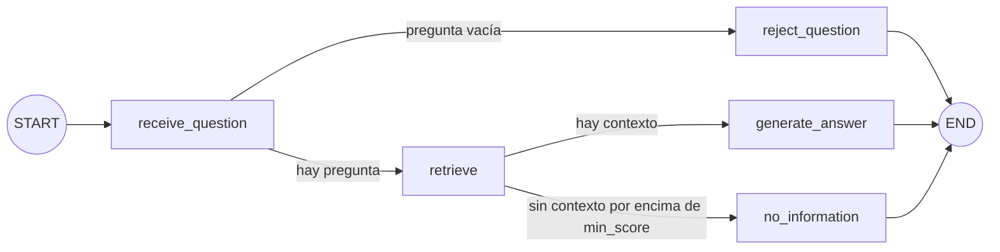

# `services/support_agent` — Agente de soporte comercial (LangGraph)

El RAG comercial de `data/pipelines/rag.py` como grafo de LangGraph: el mismo comportamiento que `POST /knowledge/query`,
con cada decisión explícita, trazada y evaluable. Se monta en la API principal (`services/api/main.py`) y convive con
`/knowledge/query`.

## Grafo



| Nodo | Responsabilidad | Escribe en el estado |
| --- | --- | --- |
| `receive_question` | Normaliza la pregunta | `question` |
| `reject_question` | Termina sin recuperar si la pregunta está vacía | `error` |
| `retrieve` | `data.pipelines.rag.retrieve(question)` | `context` |
| `generate_answer` | `data.pipelines.rag.generate_answer(question, context)` con el contexto ya recuperado | `answer` |
| `no_information` | Respuesta honesta sin llamar al modelo | `answer` |

Ningún nodo llama a `query()`: la recuperación se ejecuta una sola vez y queda en el trace.

**Estado (`state.py`):** `question`, `context`, `answer`, `error`. Sin historial de conversación: cada pregunta se
responde de forma independiente con la base de conocimiento.

**Compilación (`graph.py`):** el grafo se compila al importar el módulo, antes de cualquier corrida. Además de la
validación de LangGraph (aristas hacia nodos que no existen, falta de entrada), comprueba que cada nodo es alcanzable
desde START y llega a END. Cualquier fallo es un `AgentGraphError` con el motivo.

**Checkpointing:** `InMemorySaver`, un checkpoint por transición, con `thread_id` = `run_id`. Si un nodo falla, el hilo
se conserva y `runner.resume_run(run_id)` continúa desde el último checkpoint sin repetir los nodos terminados. Las
corridas completadas liberan su hilo; su historial queda en el trace.

## Traces

Cada corrida escribe `AGENT_TRACE_DIR/<run_id>.json` (por defecto `data/raw/agent_traces/`, ignorado por git), también
si falla: nodos en orden con su salida y duración, estado final, checkpoints y, si aplica, el nodo y el tipo de error.
El formato está en `tracing.py`. El log `trackflow.agent` deja una línea por corrida con el recorrido y la ruta del trace.

## Endpoint

`POST /agent/query` (bearer) con `{ "question": "..." }` → `{ "answer", "run_id" }`.

| Situación | Respuesta |
| --- | --- |
| Respuesta generada o sin información | 200 |
| Pregunta vacía (la decide el grafo) | 422 con el motivo |
| Qdrant, la colección o el gateway LLM no disponibles | 503 con la referencia `run_id` |
| Cualquier otro fallo de un nodo | 500 con la referencia `run_id`, sin traza |

## Evals

`data/eval/agent/eval-cases.json` define los casos; `scripts/record_agent_traces.py` graba sus traces reales en
`data/eval/agent/traces/` (necesita Qdrant indexado y el `.env`), y los evals se ejecutan contra esos traces:

```bash
uv run python scripts/record_agent_traces.py
uv run pytest tests/pipelines/test_agent_evals.py -v
```

Tests unitarios del grafo y del endpoint: `tests/pipelines/test_agent_graph.py` y `tests/http/test_agent_api.py`.
