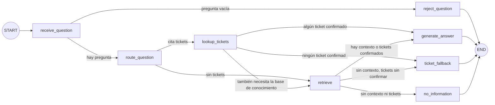

# `services/support_agent` — Agente de soporte comercial (LangGraph)

Agente de LangGraph con dos fuentes: la base de conocimiento comercial (RAG de `data/pipelines/rag.py`, políticas
estables) y el gestor de incidencias (tool de solo lectura, datos operativos en tiempo real). El propio agente decide
qué fuente necesita cada pregunta. Se monta en la API principal (`services/api/main.py`) y convive con
`/knowledge/query`.

## Grafo



| Nodo | Responsabilidad | Escribe en el estado |
| --- | --- | --- |
| `receive_question` | Normaliza la pregunta | `question` |
| `reject_question` | Termina sin consultar nada si la pregunta está vacía | `error` |
| `route_question` | Decide las fuentes (`routing.plan_route`) | `route` |
| `lookup_tickets` | Tool `get_ticket` por cada ticket de la pregunta | `tickets` |
| `retrieve` | `data.pipelines.rag.retrieve(question)` | `context` |
| `generate_answer` | `data.pipelines.rag.generate_answer(question, context)` con el contexto recuperado y los tickets confirmados | `answer` |
| `ticket_fallback` | Respuesta honesta sin llamar al modelo: ningún ticket se pudo confirmar | `answer` |
| `no_information` | Respuesta honesta sin llamar al modelo: nada superó el umbral del RAG | `answer` |

Ningún nodo llama a `query()`: cada fuente se consulta una sola vez y queda en el trace. Un ticket que no se pudo
confirmar nunca llega al modelo; el agente lo avisa con un texto fijo y no inventa un estado.

**Estado (`state.py`):** `question`, `route`, `tickets`, `context`, `answer`, `error`. Sin historial de conversación:
cada pregunta se responde de forma independiente.

**Enrutado (`routing.py`):** el modelo de generación devuelve un JSON `{ticket_ids, needs_knowledge}`. Solo se aceptan
los números de ticket que aparecen en la pregunta, y sin tickets la pregunta va al RAG. Si el modelo falla o su JSON no
es válido, deciden las reglas (`route_by_rules`: referencias explícitas como "ticket 482" o "incidencia nº 17"). El
trace guarda quién decidió (`decided_by`).

**Compilación (`graph.py`):** el grafo se compila al importar el módulo, antes de cualquier corrida. Además de la
validación de LangGraph (aristas hacia nodos que no existen, falta de entrada), comprueba que cada nodo es alcanzable
desde START y llega a END. Cualquier fallo es un `AgentGraphError` con el motivo.

**Checkpointing:** `InMemorySaver`, un checkpoint por transición, con `thread_id` = `run_id`. Si un nodo falla, el hilo
se conserva y `runner.resume_run(run_id)` continúa desde el último checkpoint sin repetir los nodos terminados. Las
corridas completadas liberan su hilo; su historial queda en el trace.

## Tool de tickets (`tools/incidents.py`)

| | |
| --- | --- |
| Entrada | `TicketQuery(ticket_id: int > 0)` |
| Salida | `TicketLookup(ticket_id, outcome, ticket)`; `outcome` = `found`, `not_found`, `timeout` o `unavailable`; `ticket` = `id`, `title`, `description`, `status`, `category`, `origin`, `branch`, `created_at`, `updated_at` |
| Servicio | `GET {INCIDENTS_API_URL}/api/incidents/{id}` (por defecto `http://127.0.0.1:8000`); solo `GET` |
| Auth | Bearer firmado con `JWT_SECRET_KEY` para la cuenta de servicio `AGENT_SERVICE_USER_ID` (una cuenta activa de `auth.json`), válido 5 minutos |
| Timeout | `INCIDENTS_TIMEOUT_SECONDS` = 4 s |
| Fallback | 404 → `not_found`; timeout → `timeout`; red caída, 401/5xx o respuesta inválida → `unavailable`. Nunca lanza excepciones al grafo |

## Traces

Cada corrida escribe `AGENT_TRACE_DIR/<run_id>.json` (por defecto `data/raw/agent_traces/`, ignorado por git), también
si falla: `sources_used` (fuentes consultadas en orden: `incidents_tool`, `rag`), nodos en orden con su salida y
duración, estado final, checkpoints y, si aplica, el nodo y el tipo de error. El formato está en `tracing.py`. El log
`trackflow.agent` deja una línea por corrida con las fuentes, el recorrido y la ruta del trace.

## Endpoint

`POST /agent/query` (bearer) con `{ "question": "..." }` → `{ "answer", "run_id" }`.

| Situación | Respuesta |
| --- | --- |
| Respuesta generada, sin información o ticket sin confirmar | 200 |
| Pregunta vacía (la decide el grafo) | 422 con el motivo |
| Qdrant, la colección o el gateway LLM no disponibles | 503 con la referencia `run_id` |
| Cualquier otro fallo de un nodo | 500 con la referencia `run_id`, sin traza |

## Evals

`data/eval/agent/eval-cases.json` define los casos (RAG, tool, ambos, ticket inexistente y gestor caído);
`scripts/record_agent_traces.py` graba sus traces reales en `data/eval/agent/traces/` (necesita Qdrant indexado, el
`.env` y la API sirviendo el gestor en `INCIDENTS_API_URL`), y los evals se ejecutan contra esos traces:

```bash
uv run python scripts/record_agent_traces.py
uv run pytest tests/pipelines/test_agent_evals.py -v
```

Tests unitarios: `tests/pipelines/test_agent_graph.py` (grafo y fallback), `tests/pipelines/test_agent_routing.py`
(enrutado), `tests/pipelines/test_incidents_tool.py` (tool) y `tests/http/test_agent_api.py` (endpoint, con un caso de
extremo a extremo contra el gestor de incidencias).
