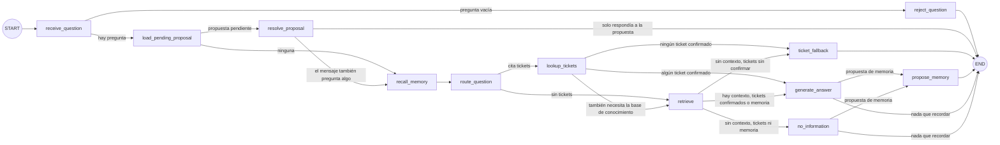

# `services/support_agent` — Agente de soporte comercial (LangGraph)

Agente de LangGraph con dos fuentes: la base de conocimiento comercial (RAG de `data/pipelines/rag.py`, políticas
estables) y el gestor de incidencias (tool de solo lectura del servidor MCP `mcps/trackflow_tools`, datos operativos en
tiempo real). El propio agente decide
qué fuente necesita cada pregunta. Se monta en la API principal (`services/api/main.py`) y convive con
`/knowledge/query`.

Además tiene **memoria aprobada** (`memory/`, sobre Redis): propone recordar correcciones dentro de su respuesta y solo
las guarda si el usuario lo decide explícitamente en el turno siguiente. Diseño, política de lo que nunca se recuerda
y evidencias en [`docs/agent-memory/memory-design.md`](../../docs/agent-memory/memory-design.md).

## Grafo



| Nodo | Responsabilidad | Escribe en el estado |
| --- | --- | --- |
| `receive_question` | Normaliza la pregunta | `question` |
| `reject_question` | Termina sin consultar nada si la pregunta está vacía | `error` |
| `load_pending_proposal` | Propuesta de memoria del usuario pendiente en esta conversación (antes descarta las caducadas) | `pending_proposal` |
| `resolve_proposal` | Clasifica el mensaje frente a la propuesta (`approve`, `reject`, `edit`, `unrelated`), consolida si se aprueba y lo audita | `memory_decision`, `answer` o `question` |
| `recall_memory` | Entradas de la memoria aprobada relevantes para la pregunta (como mucho 5) | `memories` |
| `route_question` | Decide las fuentes (`routing.plan_route`) | `route` |
| `lookup_tickets` | Tool `get_ticket` (cliente MCP) por cada ticket de la pregunta | `tickets` |
| `retrieve` | `data.pipelines.rag.retrieve(question)` | `context` |
| `generate_answer` | `memory.self_evaluation.generate_reply(question, context)`: una sola llamada que devuelve la respuesta y `propuesta_memoria`, con el contexto recuperado, los tickets confirmados y la memoria recordada | `answer`, `memory_candidate` |
| `ticket_fallback` | Respuesta honesta sin llamar al modelo: ningún ticket se pudo confirmar | `answer` |
| `no_information` | Respuesta fija sin contexto; el modelo solo auto-evalúa el mensaje (su texto no se usa) | `answer`, `memory_candidate` |
| `propose_memory` | Valida la propuesta (`memory.policy`), la deja pendiente y la pregunta al final de la respuesta | `memory_proposal`, `answer` |

Ningún nodo llama a `query()`: cada fuente se consulta una sola vez y queda en el trace. Un ticket que no se pudo
confirmar nunca llega al modelo; el agente lo avisa con un texto fijo y no inventa un estado.

**Estado (`state.py`):** `question`, `message`, `conversation_id`, `user_id`, `run_id`, los campos de memoria
(`pending_proposal`, `memory_decision`, `memories`, `memory_candidate`, `memory_proposal`, `memory_notices`), `route`,
`tickets`, `context`, `answer`, `error`. Sin historial de conversación: lo único que une dos turnos es la propuesta
pendiente, que vive en Redis.

**Enrutado (`routing.py`):** el modelo de generación devuelve un JSON `{ticket_ids, needs_knowledge}`. Solo se aceptan
los números de ticket que aparecen en la pregunta, y sin tickets la pregunta va al RAG. Si el modelo falla o su JSON no
es válido, deciden las reglas (`route_by_rules`: referencias explícitas como "ticket 482" o "incidencia nº 17"). El
trace guarda quién decidió (`decided_by`).

**Compilación (`graph.py`):** el grafo se compila al importar el módulo, antes de cualquier corrida. Además de la
validación de LangGraph (aristas hacia nodos que no existen, falta de entrada), comprueba que cada nodo es alcanzable
desde START y llega a END. Cualquier fallo es un `AgentGraphError` con el motivo.

**Checkpointing:** `InMemorySaver`, un checkpoint por transición, con `thread_id` = `run_id`. Si un nodo falla, el hilo
se conserva y `runner.resume_run(run_id)` continúa desde el último checkpoint sin repetir los nodos terminados. Las
corridas completadas liberan su hilo; su historial queda en el trace.

## Tool de tickets (`tools/incidents.py`): cliente del servidor MCP

El agente no llama a la API de incidencias. `lookup_tickets` usa la tool `get_ticket_status` del servidor MCP
(`mcps/trackflow_tools`), cargada con `langchain-mcp-adapters` (`MultiServerMCPClient`, Streamable HTTP). Es el único
camino del agente hacia el gestor: la llamada HTTP directa que usaba antes se eliminó.

| | |
| --- | --- |
| Entrada | `TicketQuery(ticket_id: int > 0)` |
| Salida | `TicketLookup(ticket_id, outcome, ticket)`; `outcome` = `found`, `not_found`, `timeout` o `unavailable`; `ticket` = `id`, `title`, `description`, `status`, `category`, `origin`, `branch`, `created_at`, `updated_at` |
| Servidor | `MCP_SERVER_URL` (por defecto `http://127.0.0.1:8001/mcp`; en el contenedor `api`, `DOCKER_MCP_SERVER_URL` = `http://mcp:8001/mcp`); el agente solo carga `get_ticket_status` |
| Auth | Token OAuth `client_credentials` del cliente `support-agent` (`AGENT_OAUTH_CLIENT_ID`, `KEYCLOAK_AGENT_CLIENT_SECRET`), pedido al issuer `MCP_OAUTH_ISSUER` (en el contenedor `api`, `DOCKER_MCP_OAUTH_ISSUER` = `http://keycloak:8080/realms/trackflow`; el `iss` del token sigue siendo `KEYCLOAK_URL`). Solo tiene el scope `incidents:read`: el servidor le rechaza crear tickets, cambiar su estado o leer inventario (`INSUFFICIENT_SCOPE`) |
| Timeout | `INCIDENTS_TIMEOUT_SECONDS` = 4 s (token y llamada MCP) |
| Fallback | `NOT_FOUND` → `not_found`; timeout → `timeout`; servidor MCP o Keycloak caídos, sin credenciales, otro código de error o respuesta inválida → `unavailable`. Nunca lanza excepciones al grafo |

El enrutado entre RAG y tools no cambia: el nodo y su contrato son los mismos, solo cambia el camino hasta el gestor.

## Traces

Cada corrida escribe `AGENT_TRACE_DIR/<run_id>.json` (por defecto `data/raw/agent_traces/`, ignorado por git), también
si falla: `sources_used` (fuentes consultadas en orden: `incidents_tool`, `rag`), nodos en orden con su salida y
duración, estado final, checkpoints y, si aplica, el nodo y el tipo de error. El formato está en `tracing.py`. El log
`trackflow.agent` deja una línea por corrida con las fuentes, el recorrido y la ruta del trace.

## Endpoint

`POST /agent/query` (bearer) con `{ "question": "..." }` → `{ "answer", "run_id" }`.

| Situación | Respuesta |
| --- | --- |
| Respuesta generada, sin información o ticket sin confirmar | 200 |
| Pregunta vacía (la decide el grafo) | 422 con el motivo |
| Qdrant, la colección o el gateway LLM no disponibles | 503 con la referencia `run_id` |
| Cualquier otro fallo de un nodo | 500 con la referencia `run_id`, sin traza |

## Evals

`data/eval/agent/eval-cases.json` define los casos (RAG, tool, ambos, ticket inexistente y gestor caído);
`scripts/record_agent_traces.py` graba sus traces reales en `data/eval/agent/traces/` (necesita Qdrant indexado, el
`.env`, Keycloak, la API y el servidor MCP en `MCP_SERVER_URL`), y los evals se ejecutan contra esos traces:

```bash
uv run python scripts/record_agent_traces.py
uv run pytest tests/pipelines/test_agent_evals.py -v
```

Tests unitarios: `tests/pipelines/test_agent_graph.py` (grafo y fallback), `tests/pipelines/test_agent_routing.py`
(enrutado), `tests/pipelines/test_incidents_tool.py` (tool) y `tests/http/test_agent_api.py` (endpoint, con un caso de
extremo a extremo: agente → servidor MCP → gestor de incidencias).
